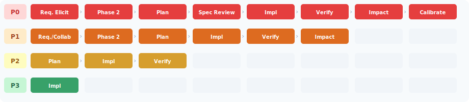
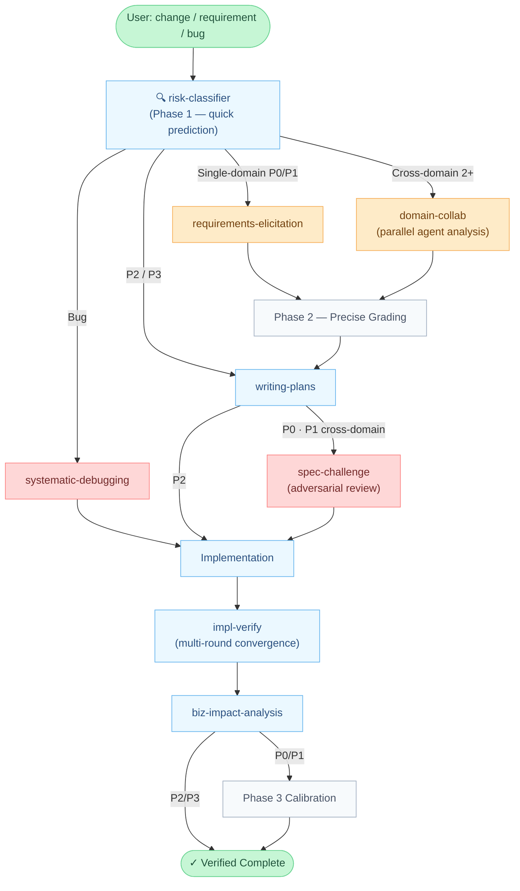
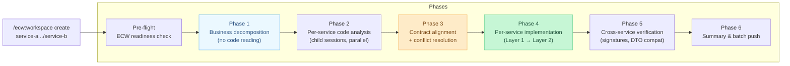

# Enterprise Change Workflow (ECW)

[](LICENSE)

[](https://claude.ai/claude-code)

[中文文档](README.zh-CN.md)

> Give AI the ability to "change one line of code, trace the full-chain impact" in large projects.

---

## The Problem

AI assistants excel at independent changes but miss cascading effects in large multi-module systems:

- Changed a Facade method signature — 5 other domains were calling it
- Fixed an MQ message format — 3 external consumers were silently broken
- Accepted a "simple requirement" — it touched a state machine, shared resources, and an end-to-end path

ECW enforces a **risk-proportional workflow** before any code is written. A log change and an inventory deduction should not require the same process.

---

## Risk-Driven Depth

Every change is classified P0–P3. The risk level determines workflow depth — nothing more and nothing less.



| Level | Risk | Typical Scenarios |
|-------|------|------------------|
| **P0** | Critical | Multi-domain state machine changes, core path refactoring |
| **P1** | High | Shared resource modifications, MQ format changes |
| **P2** | Medium | Single-domain field additions, local logic adjustments |
| **P3** | Low | Log adjustments, copy changes, config updates |

---

## How It Works



The three-phase risk classifier runs throughout: **Phase 1** (quick keyword prediction) → **Phase 2** (precise grading after full analysis) → **Phase 3** (post-implementation calibration to improve future predictions).

---

## Walkthrough: A Real Scenario

> *"Add a coupon deduction step to the order submission flow"*

1. **risk-classifier** matches: `order submission` (P1 floor) + `coupon` found in `shared-resources.md` → **escalates to P0**
2. **domain-collab** dispatches parallel agents: Order, Coupon, and Payment domains analyze independently
3. Cross-evaluation round: Payment domain flags a double-deduction edge case the others missed
4. **writing-plans** generates a risk-aware plan with domain context injected from knowledge files
5. **spec-challenge** runs an independent adversarial review → finds a missing rollback path
6. Implementation proceeds against the corrected plan
7. **impl-verify** runs 4 parallel rounds: code vs. requirements / domain rules / plan / engineering standards
8. **biz-impact-analysis** scans git diff → flags downstream impact on loyalty point accrual (an e2e path not mentioned in the requirement)

Without ECW, steps 2–3 and 8 would be invisible.

---

## Knowledge-Driven Analysis

ECW's impact analysis depends on project-level knowledge files. Five cross-domain knowledge types form the dependency graph used by `risk-classifier`, `domain-collab`, and `biz-impact-analysis`:

| # | File | Content |
|---|------|---------|
| §1 | `cross-domain-calls.md` | Domain-to-domain call matrix |
| §2 | `mq-topology.md` | MQ topic publish/subscribe relationships |
| §3 | `shared-resources.md` | Services/components shared by 2+ domains |
| §4 | `external-systems.md` | External system integrations |
| §5 | `e2e-paths.md` | End-to-end critical business paths |

Knowledge file quality directly determines analysis accuracy. Java/Spring projects can bootstrap these with the included scanning scripts (see [Installation](#installation)).

---

## Multi-Repo Workspace

For changes spanning **2+ independent repositories** (e.g., provider + consumer services), `ecw:workspace` provides git worktree isolation and a 6-Phase coordinator flow.



**Key design:** Phase 1 does business decomposition with zero code reading — preventing premature optimization. Contract conflicts always surface to the user before implementation begins.

```bash
/ecw:workspace create service-a ../service-b
/ecw:workspace status
/ecw:workspace push
```

---

## Design Principles

ECW is built around one question: **when the next model generation arrives, does this layer get stronger or become dead weight?**

**Amplifiers vs. Crutches** — Every component is one of two types. Amplifiers orchestrate what models cannot do alone: governance processes, audit trails, organizational rules. They get stronger as models improve. Crutches compensate for what models *currently* do poorly: step-by-step reasoning prompts, keyword routing tables, context window workarounds. They become dead weight when the model improves.

**Deterministic gates over prompt instructions** — When a behavior must reliably happen, it lives in a hook or script, not a prompt. The signal: if a prompt instruction appears 3+ times with words like MUST or CRITICAL, it belongs in a mechanism.

**Risk proportionality** — Every decision (workflow depth, model selection, hook strictness, verification rounds) references the risk level. P0 and P3 should feel completely different.

→ [Full design principles](docs/design-principles.md)

---

## Installation

### 1. Register Marketplace

Add to `~/.claude/settings.json`:

```json
{
  "extraKnownMarketplaces": {
    "enterprise-change-workflow": {
      "source": {
        "source": "github",
        "repo": "Aimeerrhythm/enterprise-change-workflow"
      }
    }
  }
}
```

### 2. Install Plugin

```bash
claude plugin install ecw@enterprise-change-workflow
```

### 3. Initialize Project

In your target project directory:

```
/ecw-init
```

Three modes: **Attach** (project already has docs), **Manual** (docs in non-standard locations), **Scaffold** (new project — generates complete knowledge templates).

### 4. Configure CLAUDE.md

Add domain routing and completion rules to your project's `CLAUDE.md`. See `templates/CLAUDE.md.snippet`.

### 5. Populate Knowledge Files

For Java/Spring projects:

```bash
bash <plugin-path>/scripts/java/scan-cross-domain-calls.sh <project_root> <path_mappings_file>
bash <plugin-path>/scripts/java/scan-shared-resources.sh  <project_root> <path_mappings_file>
bash <plugin-path>/scripts/java/scan-mq-topology.sh       <project_root>
```

### 6. Verify

```
/ecw-validate-config
```

---

## Components

<details>
<summary>Skills (15)</summary>

| Component | Trigger | Description |
|-----------|---------|-------------|
| `ecw:risk-classifier` | Any change/requirement/bug | P0-P3 risk classification + workflow routing, three phases |
| `ecw:domain-collab` | Cross-domain requirements (2+ domains) | Parallel domain agents analyze independently → mutual evaluation → cross-verification |
| `ecw:requirements-elicitation` | Single-domain P0/P1 requirements | 9-dimension systematic questioning |
| `ecw:writing-plans` | After requirements analysis (P0-P2) | Risk-aware planning with domain context injection |
| `ecw:spec-challenge` | After plan output (P0; P1 cross-domain only) | Independent adversarial review, challenge-response cycles |
| `ecw:tdd` | Before implementation (P0-P2) | Risk-differentiated test-driven development |
| `ecw:impl-orchestration` | Plan execution, 4+ tasks (P0/P1) | Dependency-graph parallel layers + worktree isolation |
| `ecw:systematic-debugging` | Bug/test failure | Domain-knowledge-driven root cause analysis |
| `ecw:impl-verify` | After implementation (P0-P2) | Multi-round convergence: code ↔ requirements/rules/plan/standards |
| `ecw:biz-impact-analysis` | After impl-verify | Git diff → structured business impact report |
| `ecw:cross-review` | Manual only | Cross-file structural consistency (optional tool) |
| `ecw:knowledge-audit` | Manual, periodic | Knowledge base health check: stale refs, content composition |
| `ecw:knowledge-track` | Manual, post-task | Doc utilization tracking (hit/miss/redundant/misleading) |
| `ecw:knowledge-repomap` | Manual, after refactors | Auto-generate code structure index |
| `ecw:workspace` | Manual only | Multi-repo workspace: 6-Phase coordinator + git worktree isolation |

</details>

<details>
<summary>Agents (7)</summary>

| Component | Dispatcher | Description |
|-----------|-----------|-------------|
| `biz-impact-analysis` | `ecw:biz-impact-analysis` | 5-step: diff parsing → dependency graph → code scan → external system eval → report |
| `spec-challenge` | `ecw:spec-challenge` | 4-dimension review: accuracy / information quality / boundaries / robustness |
| `domain-analyst` | `ecw:domain-collab` | R1 independent domain analysis |
| `domain-negotiator` | `ecw:domain-collab` | R2 cross-domain negotiation |
| `implementer` | `ecw:impl-orchestration` | Per-task implementation with Fact-Forcing Gate traceability |
| `spec-reviewer` | `ecw:impl-orchestration` | Per-task spec compliance review |
| `impl-verifier` | `ecw:impl-verify` | Parallel 4-round verification |

</details>

<details>
<summary>Hooks (6 event points, dispatcher architecture)</summary>

ECW uses a unified dispatcher pattern. `hooks.json` registers 6 event points:

| Event | File | Description |
|-------|------|-------------|
| `SessionStart` | `session-start.py` | Auto-inject session-state / checkpoint / ecw.yml context + instincts |
| `Stop` | `stop-persist.py` | Marker-based state persistence |
| `PreToolUse` | `dispatcher.py` | Unified dispatcher with 5 sub-modules (profile-gated) |
| `PostToolUse` | `post-edit-check.py` | Anti-pattern detection on Edit/Write |
| `PreCompact` | `pre-compact.py` | Recovery guidance injection before context compaction |
| `SessionEnd` | `session-end.py` | Session cleanup |

**Dispatcher sub-modules** (P0 → strict, P1/P2 → standard, P3 → minimal):

| Sub-module | Profiles | Description |
|------------|----------|-------------|
| `verify-completion` | all | 4 hard blocks + 1 soft reminder before task completion |
| `config-protect` | all | Block AI from modifying critical ECW config files |
| `compact-suggest` | all | Proactive context compaction suggestion |
| `secret-scan` | standard, strict | Detect sensitive data (AWS keys, JWT, GitHub tokens) |
| `bash-preflight` | standard, strict | Dangerous command pre-check (--no-verify, push --force, rm -rf) |

**Hard blocks (failure prevents completion):**
1. Broken reference — modified files reference non-existent `.claude/` paths
2. Stale reference — deleted files still referenced elsewhere
3. Java compilation — auto-runs `mvn compile` when `.java` files are modified
4. Java tests — auto-runs `mvn test` (controlled by `ecw.yml` `verification.run_tests`)

</details>

<details>
<summary>Commands (3)</summary>

| Command | Description |
|---------|-------------|
| `/ecw-init` | Project initialization wizard (3 modes: Attach/Manual/Scaffold) |
| `/ecw-validate-config` | Validate ECW configuration completeness (7-step check) |
| `/ecw-upgrade` | Upgrade project ECW config to latest plugin version (idempotent migrations) |

</details>

<details>
<summary>Project structure</summary>

```
enterprise-change-workflow/
├── skills/                      # 15 core skills
├── agents/                      # 7 agent definitions
├── commands/                    # 3 slash commands
├── hooks/                       # 6 event-point hook architecture
│   ├── hooks.json               # Hook registration
│   ├── dispatcher.py            # PreToolUse unified dispatcher
│   ├── verify-completion.py     # 4 hard blocks + 1 soft reminder
│   ├── config-protect.py        # Config file protection
│   ├── compact-suggest.py       # Proactive compaction suggestion
│   ├── secret-scan.py           # Sensitive data detection
│   ├── bash-preflight.py        # Dangerous command pre-check
│   ├── session-start.py         # Context injection + instinct loading
│   └── ...
├── templates/                   # Config and knowledge file templates
├── scripts/java/                # Java/Spring project scanners (3 scripts)
├── docs/                        # Design reference
│   ├── design-principles.md     # Amplifiers vs. crutches, five tests
│   └── design-reference.md      # Token budgets, model selection
├── tests/                       # Lint + hook unit tests + promptfoo evals
├── CLAUDE.md
├── CHANGELOG.md
├── CONTRIBUTING.md
└── TROUBLESHOOTING.md
```

</details>

---

## Upgrading

```bash
# Update plugin
claude plugin update ecw@enterprise-change-workflow

# Migrate project config (if new version includes config changes)
/ecw-upgrade
```

---

## Troubleshooting

**Skills don't appear after update** — Restart the Claude Code session after `claude plugin update`.

**`/ecw-validate-config` shows warnings after `/ecw-init`** — Expected. Templates need to be filled with your project's actual content.

**`verify-completion` reports broken reference** — A file you modified references a `.claude/` path that doesn't exist. Check for typos or moved files.

**Phase 1 risk level is inaccurate** — Two common causes: (1) keyword mappings in `change-risk-classification.md` are incomplete; (2) `shared-resources.md` is missing entries. Use scanning scripts to re-extract, then re-run Phase 3 calibration.

→ [Full troubleshooting guide](TROUBLESHOOTING.md)

---

## Contributing · License

See [CONTRIBUTING.md](CONTRIBUTING.md) for development conventions and review checklist.

[MIT License](LICENSE)
