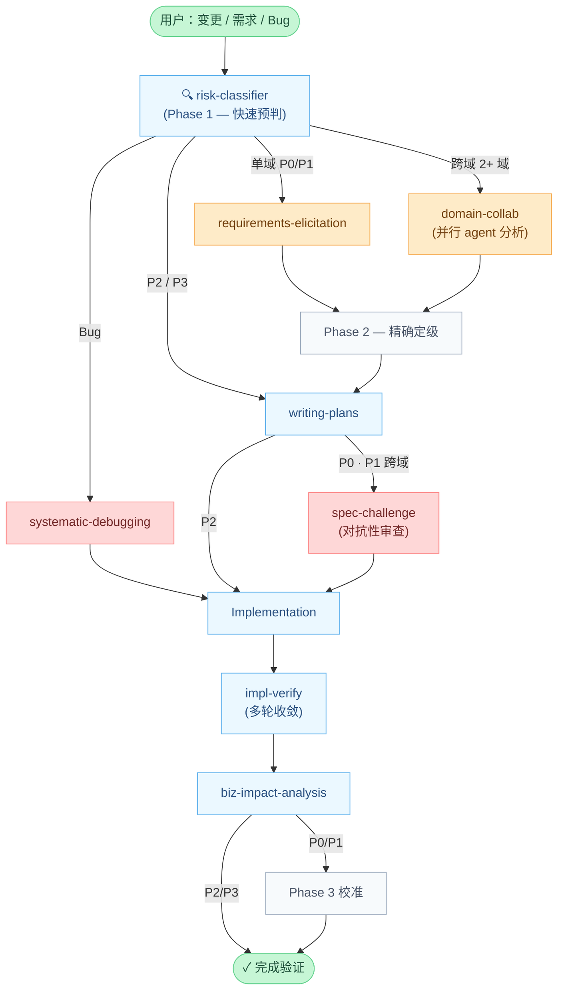
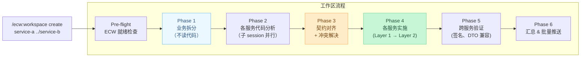

# Enterprise Change Workflow (ECW)

[](LICENSE)

[](https://claude.ai/claude-code)

[English](README.md)

> 给 AI 在大型项目上"改一行代码，追踪全链路影响"的能力。

---

## 解决什么问题

AI 编码助手在处理独立变更时表现出色，但在大型多模块项目中，一个组件的修改可能级联影响多个业务域：

- 改了一个 Facade 方法签名，不知道有 5 个其他域在调用它
- 修了一个 MQ 消息格式，遗漏了 3 个外部系统的消费方
- 接了一个"简单需求"，实际涉及状态机变更、共享资源、端到端链路

ECW 强制执行**风险匹配的工作流**，在动手写代码之前先评估风险、分析影响。改日志和改库存扣减的流程不应该一样重。

---

## 风险驱动的流程深度

每个变更都会被分级为 P0–P3，风险等级决定流程深度——不多不少。


| 等级 | 风险 | 典型场景 |
|------|------|---------|
| **P0** | 极高 | 多域状态机变更、核心链路改造 |
| **P1** | 高 | 共享资源修改、MQ 消息格式变更 |
| **P2** | 中 | 单域新增字段、局部逻辑调整 |
| **P3** | 低 | 日志调整、文案修改、配置更新 |

---

## 工作流总览



风险分级器贯穿全程三个阶段：**Phase 1**（关键词快速预判）→ **Phase 2**（需求分析完成后精确定级）→ **Phase 3**（实现完成后反馈校准，改进未来预测准确度）。

---

## 真实场景走一遍

> *"在下单流程中增加优惠券扣减步骤"*

1. **risk-classifier** 匹配：`下单流程`（P1 下限）+ `优惠券` 在 `shared-resources.md` 中存在 → **升级为 P0**
2. **domain-collab** 调度并行 agent：订单域、优惠券域、支付域各自独立分析
3. 交叉评估轮次：支付域发现另外两个域遗漏的重复扣减边界情况
4. **writing-plans** 根据知识文件注入域上下文，生成风险感知实现方案
5. **spec-challenge** 独立对抗性审查 → 发现缺失回滚路径
6. 按修正后的方案进入实现
7. **impl-verify** 并行 4 轮：代码 vs. 需求 / 域规则 / Plan / 工程标准
8. **biz-impact-analysis** 扫描 git diff → 发现需求中未提及的下游影响：积分累计 e2e 链路

没有 ECW，步骤 2–3 和步骤 8 都会被忽略。

---

## 知识驱动的影响分析

ECW 的影响分析依赖项目级知识文件。五类跨域知识构成依赖图，被 `risk-classifier`、`domain-collab`、`biz-impact-analysis` 共同使用：

| 编号 | 文件 | 内容 |
|------|------|------|
| §1 | `cross-domain-calls.md` | 域间直接调用矩阵 |
| §2 | `mq-topology.md` | MQ Topic 发布/消费关系 |
| §3 | `shared-resources.md` | 2+ 域共享的服务/组件 |
| §4 | `external-systems.md` | 外部系统集成清单 |
| §5 | `e2e-paths.md` | 端到端关键业务链路 |

知识文件质量直接决定分析准确度。Java/Spring 项目可用内置扫描脚本快速提取（见[安装](#安装)）。

---

## 多仓库工作区

当变更涉及 **2 个以上独立仓库**（如 Provider + Consumer 服务）时，使用 `ecw:workspace` 进行 git worktree 隔离和 6 阶段协调器流程。



**核心设计：** Phase 1 完全不读代码，业务拆分在代码分析之前完成，避免过早优化。契约冲突在实现开始前必须由用户决策。

```bash
/ecw:workspace create service-a ../service-b
/ecw:workspace status
/ecw:workspace push
```

---

## 设计原则

ECW 的设计围绕一个问题：**下一代模型来的时候，这一层会更强还是会成为死重？**

**放大器 vs. 拐杖** — 每个组件属于两类之一。放大器编排模型自身做不到的事：治理流程、审计追踪、组织规范。模型越强，放大器产出越好。拐杖补偿模型*当前*做不好的事：分步思考引导、关键词路由表、上下文窗口变通。模型变强后，拐杖成为死重。

**确定性机制优于 Prompt 指令** — 当某个行为必须可靠发生时，用 Hook 或脚本实现，不用 Prompt 请求。判断信号：指令在文件中出现 3 次以上且带有 MUST、CRITICAL 等强调词，就该机制化。

**风险比例原则** — 所有决策（流程深度、模型选择、Hook 严格度、验证轮次）都引用风险等级。P0 和 P3 的体感应该完全不同。

→ [完整设计原则](docs/design-principles.md)

---

## 安装

### 1. 注册 Marketplace

在 `~/.claude/settings.json` 中添加：

```json
{
  "extraKnownMarketplaces": {
    "enterprise-change-workflow": {
      "source": {
        "source": "github",
        "repo": "Aimeerrhythm/enterprise-change-workflow"
      }
    }
  }
}
```

### 2. 安装插件

```bash
claude plugin install ecw@enterprise-change-workflow
```

### 3. 初始化项目

在目标项目目录下运行：

```
/ecw-init
```

三种模式：**Attach**（项目已有文档）、**Manual**（文档在非标准位置）、**Scaffold**（新项目，生成完整知识文件模板）。

### 4. 配置 CLAUDE.md

在项目 `CLAUDE.md` 中添加域路由和完成规则，参考 `templates/CLAUDE.md.snippet`。

### 5. 填充知识文件

Java/Spring 项目可用扫描脚本：

```bash
bash <plugin-path>/scripts/java/scan-cross-domain-calls.sh <project_root> <path_mappings_file>
bash <plugin-path>/scripts/java/scan-shared-resources.sh  <project_root> <path_mappings_file>
bash <plugin-path>/scripts/java/scan-mq-topology.sh       <project_root>
```

### 6. 验证

```
/ecw-validate-config
```

---

## 组件一览

<details>
<summary>Skills（15 个）</summary>

| 组件 | 触发条件 | 说明 |
|------|---------|------|
| `ecw:risk-classifier` | 任何变更/需求/Bug | P0-P3 风险分级 + 流程路由，三阶段 |
| `ecw:domain-collab` | 跨域需求（2+ 域） | 并行域 agent 独立分析 → 交叉评估 → 协调器校验 |
| `ecw:requirements-elicitation` | 单域 P0/P1 需求 | 9 维度系统性提问 |
| `ecw:writing-plans` | 需求分析后（P0-P2） | 风险感知规划 + 域上下文注入 |
| `ecw:spec-challenge` | Plan 产出后（P0; P1 仅跨域） | 独立对抗性审查，challenge-response 循环 |
| `ecw:tdd` | 实现代码前（P0-P2） | 风险差异化测试先行 |
| `ecw:impl-orchestration` | Plan 执行，4+ Tasks（P0/P1） | 依赖图分层并行 + worktree 隔离 |
| `ecw:systematic-debugging` | Bug/测试失败 | 域知识驱动根因分析 |
| `ecw:impl-verify` | 实现完成后（P0-P2） | 多轮收敛：代码 ↔ 需求/规则/Plan/工程标准 |
| `ecw:biz-impact-analysis` | impl-verify 完成后 | Git diff → 结构化业务影响报告 |
| `ecw:cross-review` | 仅手动 | 跨文件结构一致性验证（可选工具） |
| `ecw:knowledge-audit` | 手动，定期 | 知识库健康度审计：失效引用、内容构成 |
| `ecw:knowledge-track` | 手动，任务后 | 文档利用追踪（hit/miss/redundant/misleading） |
| `ecw:knowledge-repomap` | 手动，重构后 | 自动生成代码结构索引 |
| `ecw:workspace` | 仅手动 | 多仓库工作区：6 Phase 协调器 + git worktree 隔离 |

</details>

<details>
<summary>Agents（7 个）</summary>

| 组件 | 调度方 | 说明 |
|------|--------|------|
| `biz-impact-analysis` | `ecw:biz-impact-analysis` | 5 步：Diff 解析 → 依赖图 → 代码扫描 → 外部系统 → 报告 |
| `spec-challenge` | `ecw:spec-challenge` | 4 维评审：准确性 / 信息质量 / 边界 / 健壮性 |
| `domain-analyst` | `ecw:domain-collab` | R1 独立域分析 |
| `domain-negotiator` | `ecw:domain-collab` | R2 跨域协商 |
| `implementer` | `ecw:impl-orchestration` | 按 Task 实现，含 Fact-Forcing Gate |
| `spec-reviewer` | `ecw:impl-orchestration` | 按 Task 规格合规审查 |
| `impl-verifier` | `ecw:impl-verify` | 并行 4 轮验证 |

</details>

<details>
<summary>Hooks（6 个事件点，Dispatcher 架构）</summary>

ECW 使用统一 Dispatcher 模式。`hooks.json` 注册 6 个事件点：

| 事件 | 文件 | 说明 |
|------|------|------|
| `SessionStart` | `session-start.py` | 注入 session-state / checkpoint / ecw.yml 上下文 + instinct |
| `Stop` | `stop-persist.py` | Marker-based 状态持久化 |
| `PreToolUse` | `dispatcher.py` | 统一调度器，5 个子模块（Profile 门控） |
| `PostToolUse` | `post-edit-check.py` | 反模式检测（Edit/Write） |
| `PreCompact` | `pre-compact.py` | 上下文压缩前恢复引导注入 |
| `SessionEnd` | `session-end.py` | 会话结束清理 |

**Dispatcher 子模块**（P0 → strict, P1/P2 → standard, P3 → minimal）：

| 子模块 | Profile | 说明 |
|--------|---------|------|
| `verify-completion` | 全部 | 4 项硬拦截 + 1 项软提醒 |
| `config-protect` | 全部 | 阻止 AI 修改 ECW 关键配置文件 |
| `compact-suggest` | 全部 | 主动上下文压缩建议 |
| `secret-scan` | standard, strict | 敏感数据检测 |
| `bash-preflight` | standard, strict | 危险命令预检 |

**硬拦截（失败 → 阻止完成）：**
1. 断裂引用 — 修改的文件引用了不存在的 `.claude/` 路径
2. 残留引用 — 删除的文件仍被其他文件引用
3. Java 编译 — 修改 `.java` 文件时自动执行 `mvn compile`
4. Java 测试 — 修改 `.java` 文件时自动执行 `mvn test`（受 `ecw.yml` 控制）

</details>

<details>
<summary>Commands（3 个）</summary>

| 命令 | 说明 |
|------|------|
| `/ecw-init` | 项目初始化向导（3 种模式：Attach/Manual/Scaffold） |
| `/ecw-validate-config` | 验证 ECW 配置完整性（7 步检查） |
| `/ecw-upgrade` | 升级项目 ECW 配置到最新版本（幂等迁移） |

</details>

<details>
<summary>项目目录结构</summary>

```
enterprise-change-workflow/
├── skills/                      # 15 个核心 skill
├── agents/                      # 7 个 agent 定义
├── commands/                    # 3 个斜杠命令
├── hooks/                       # 6 个事件点 Hook 架构
│   ├── hooks.json               # Hook 注册
│   ├── dispatcher.py            # PreToolUse 统一调度器
│   ├── verify-completion.py     # 4 项硬拦截 + 1 项软提醒
│   ├── config-protect.py        # 配置文件保护
│   ├── compact-suggest.py       # 主动压缩建议
│   ├── secret-scan.py           # 敏感数据检测
│   ├── bash-preflight.py        # 危险命令预检
│   ├── session-start.py         # 上下文注入 + instinct 加载
│   └── ...
├── templates/                   # 配置和知识文件模板
├── scripts/java/                # Java/Spring 扫描脚本（3 个）
├── docs/                        # 设计参考文档
│   ├── design-principles.md     # 放大器 vs. 拐杖，五个试金石
│   └── design-reference.md      # Token 预算、模型选择指南
├── tests/                       # Lint + Hook 单测 + promptfoo eval
├── CLAUDE.md
├── CHANGELOG.md
├── CONTRIBUTING.md
└── TROUBLESHOOTING.md
```

</details>

---

## 升级

```bash
# 更新插件
claude plugin update ecw@enterprise-change-workflow

# 迁移项目配置（如新版本包含配置变更）
/ecw-upgrade
```

---

## 常见问题

**更新插件后 Skill 没有出现** — 执行 `claude plugin update` 后需要重启 Claude Code 会话。

**`/ecw-init` 后 `/ecw-validate-config` 显示大量 warning** — 正常现象，模板文件需要填入项目实际内容。

**`verify-completion` 报断裂引用** — 修改的文件引用了不存在的 `.claude/` 路径，检查是否有拼写错误或文件已被移动/删除。

**Phase 1 定级明显不准** — 两个常见原因：(1) `change-risk-classification.md` 关键词映射不完整；(2) `shared-resources.md` 缺少共享资源条目。用扫描脚本重新提取，再用 Phase 3 校准建议系统性改进。

→ [完整排障指南](TROUBLESHOOTING.md)

---

## 贡献 · License

参见 [CONTRIBUTING.md](CONTRIBUTING.md) 了解开发规范和评审清单。

[MIT License](LICENSE)
