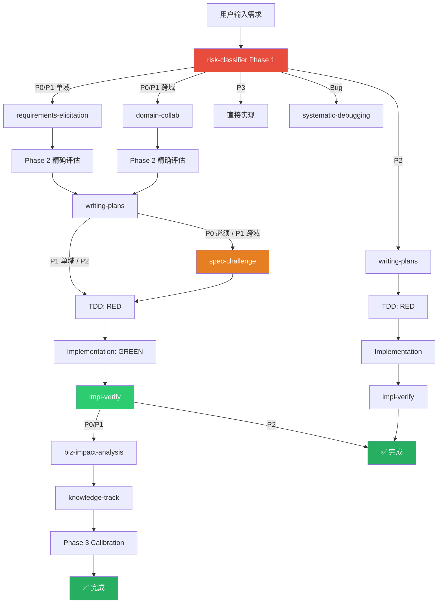
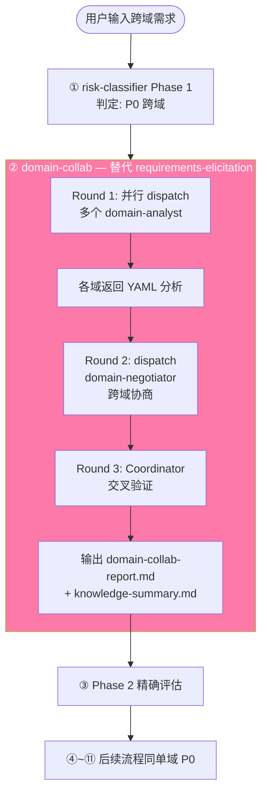
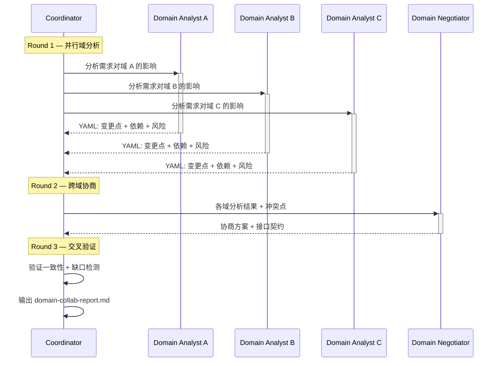
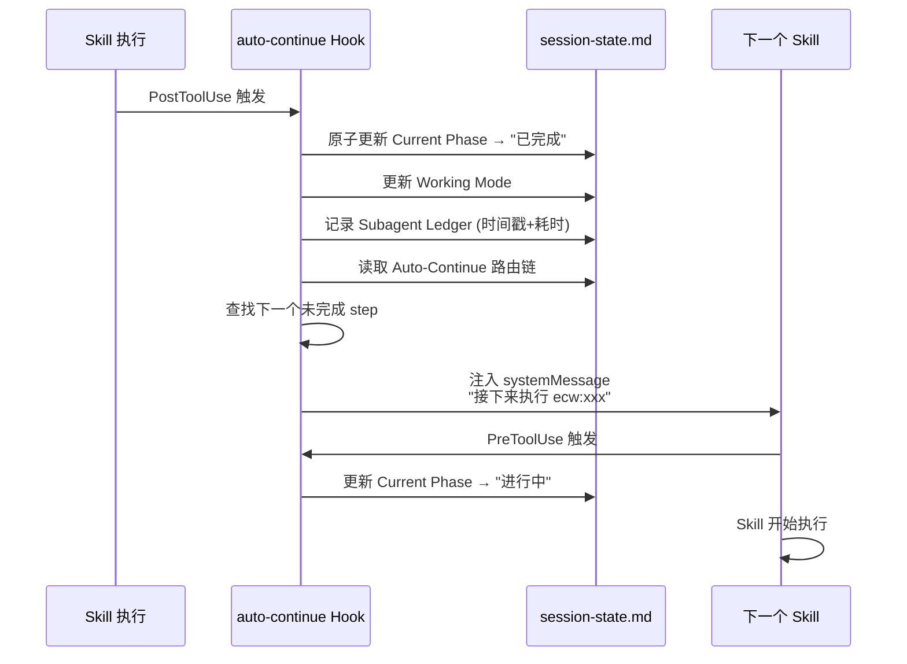
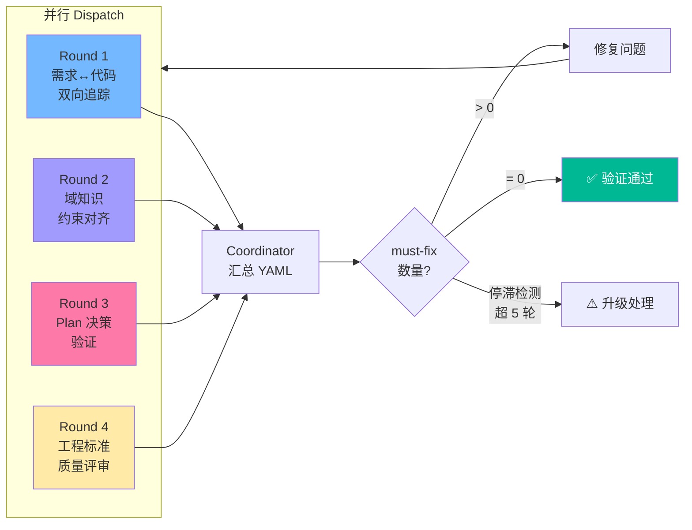
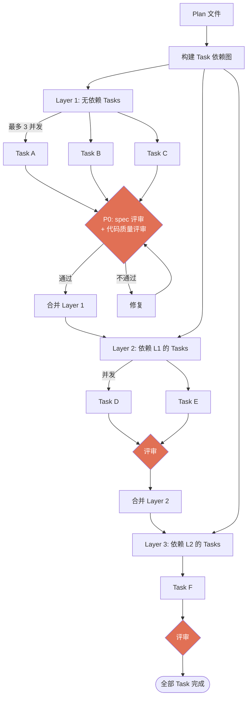
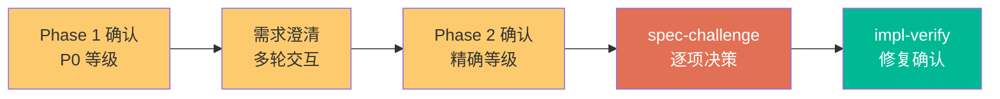

# ECW 执行流程详解

## 总览

ECW 根据 risk-classifier 输出的风险等级（P0~P3）驱动不同深度的变更管理流程。本文档以 **P0 流程**为主线，详细描述每个阶段的输入、输出、决策点和串联机制。

---

## 1. 风险等级路由总览



### 各等级路由对比

| 阶段 | P0 | P1 | P2 | P3 |
|------|----|----|----|----|
| 需求分析 | requirements-elicitation / domain-collab | 同 P0 | 跳过 | 跳过 |
| Phase 2 精确评估 | ✅ | ✅ | 跳过 | 跳过 |
| writing-plans | 完整 + 验证 + 回滚 | 完整 + 验证 | 简化 | 跳过 |
| spec-challenge | **必须** | 仅跨域 | 跳过 | 跳过 |
| TDD | 强制 + 验证日志 | 强制 | 简化模式 | 跳过 |
| impl-orchestration | Task≥4 强制 | Task≥4 强制 | 跳过 | 跳过 |
| impl-verify | 4 轮全量 | 4 轮全量 | 简化 | 跳过 |
| biz-impact-analysis | ✅ | ✅ | 跳过 | 跳过 |
| Phase 3 校准 | ✅ | ✅ | 跳过 | 跳过 |

---

## 2. P0 单域完整流程

```mermaid
flowchart TD
    START([用户输入需求]) --> PHASE1

    subgraph PHASE1 [① risk-classifier Phase 1]
        P1A[关键词匹配 → 初判 P0] --> P1B[创建 session-state.md]
        P1B --> P1C[写入 Auto-Continue 路由链]
        P1C --> P1D[创建 post-impl Tasks:<br/>Task#3 impl-verify<br/>Task#4 biz-impact-analysis<br/>Task#5 Phase 3 Calibration]
        P1D --> P1E{👤 用户确认<br/>P0 等级是否准确?}
    end

    P1E --> |确认| REQE

    subgraph REQE [② requirements-elicitation]
        R1[9 维系统提问] --> R2{👤 多轮交互<br/>需求是否充分?}
        R2 --> |补充| R1
        R2 --> |充分| R3[dispatch Sonnet 综合分析]
        R3 --> R4[输出 requirements-summary.md]
    end

    R4 --> PHASE2

    subgraph PHASE2 [③ risk-classifier Phase 2]
        P2A[dispatch Sonnet 查询依赖图] --> P2B[结合代码分析]
        P2B --> P2C[精确等级判定]
        P2C --> P2D{升降级?}
        P2D --> |降级| P2E[调整路由链]
        P2D --> |维持 P0| P2F[输出 phase2-assessment.md]
        P2E --> P2F
        P2F --> P2G{👤 用户确认<br/>等级 + 结论}
    end

    P2G --> |确认| WP

    subgraph WP [④ writing-plans]
        W1[P0 细度: 完整任务分解<br/>+ 验证步骤 + 回滚说明]
        W1 --> W2{≥2域 或<br/>知识文件≥3?}
        W2 --> |Yes| W3[dispatch Opus 子代理]
        W2 --> |No| W4[直接模式编写]
        W3 --> W5[输出 Plan 文件]
        W4 --> W5
        W5 --> W6{评估实现策略}
        W6 --> |Task≤3 文件≤5| STRATEGY_DIRECT[标记: direct]
        W6 --> |Task 4-8 P0| STRATEGY_ORCH[标记: impl-orchestration]
        W6 --> |Task>8| STRATEGY_ORCH
    end

    STRATEGY_DIRECT --> SPEC
    STRATEGY_ORCH --> SPEC

    subgraph SPEC [⑤ spec-challenge ★ P0 必须]
        S1[dispatch Opus 独立审查 Plan] --> S2[返回 Fatal + Improvement]
        S2 --> S3{👤 对每个 Fatal 项}
        S3 --> |同意修改| S4[执行修改]
        S3 --> |反对| S5[记录理由, 跳过]
        S3 --> |讨论| S6[限 3 轮讨论]
        S6 --> S3
        S4 --> S7[Improvement 项批量多选]
        S5 --> S7
        S7 --> S8[更新 Plan + 输出报告]
        S8 --> S9{👤 确认修改后 Plan}
    end

    S9 --> |确认| TDDP

    subgraph TDDP [⑥ TDD: RED]
        T1[根据 Plan 每个 Task 编写测试] --> T2[执行测试 → 全部 RED]
        T2 --> T3[记录测试输出日志]
    end

    T3 --> IMPLP

    subgraph IMPLP [⑦ Implementation: GREEN]
        I0{实现策略?}
        I0 --> |direct| I1[逐 Task 实现 → 测试变绿]
        I0 --> |orchestration| I2[构建 Task 依赖图]
        I2 --> I3[分层并行 dispatch<br/>最多 3 并发]
        I3 --> I4[P0 每 Task 强制:<br/>spec 评审 + 代码质量评审]
        I4 --> I5[合并 + 冲突解决]
        I1 --> I6[RED→GREEN→Refactor 循环]
        I5 --> I6
    end

    I6 --> VERIFY

    subgraph VERIFY [⑧ impl-verify — 4 轮并行]
        V1[并行 dispatch 4 个 Sonnet 子代理]
        V1 --> V2[Round 1: 需求↔代码追踪]
        V1 --> V3[Round 2: 域知识约束对齐]
        V1 --> V4[Round 3: Plan 决策验证]
        V1 --> V5[Round 4: 工程标准评审]
        V2 --> V6[Coordinator 汇总]
        V3 --> V6
        V4 --> V6
        V5 --> V6
        V6 --> V7{must-fix > 0?}
        V7 --> |Yes| V8[修复 + 重新验证<br/>最多 5 轮]
        V8 --> V6
        V7 --> |No| V9[✅ 验证通过]
    end

    V9 --> BIA

    subgraph BIA [⑨ biz-impact-analysis]
        B1[dispatch Opus 子代理] --> B2[输入: git diff]
        B2 --> B3[分析业务流程 / 外部系统 / e2e 路径]
        B3 --> B4{发现未注册<br/>跨域调用?}
        B4 --> |Yes| B5[自动回填 cross-domain-calls.md]
        B4 --> |No| B6[输出业务影响报告]
        B5 --> B6
    end

    B6 --> KT

    subgraph KT [⑩ knowledge-track]
        K1[追踪知识利用: hit/miss/redundant/misleading]
        K1 --> K2[输出 doc-tracker.md]
    end

    K2 --> CAL

    subgraph CAL [⑪ Phase 3 Calibration]
        C1[对比 Phase 1/2 预测 vs 实际] --> C2[输出 calibration-log.md]
        C2 --> C3[输出 calibration-history.md]
        C3 --> C4[输出 instincts.md<br/>置信度 > 0.7]
    end

    CAL --> FINISH([✅ P0 流程完成])

    style PHASE1 fill:#ffeaa7
    style REQE fill:#dfe6e9
    style PHASE2 fill:#ffeaa7
    style WP fill:#74b9ff
    style SPEC fill:#e17055,color:#fff
    style TDDP fill:#a29bfe
    style IMPLP fill:#6c5ce7,color:#fff
    style VERIFY fill:#00b894,color:#fff
    style BIA fill:#fdcb6e
    style KT fill:#dfe6e9
    style CAL fill:#b2bec3
```



---

## 3. P0 跨域流程差异

跨域 P0 在需求分析阶段使用 **domain-collab** 替代 requirements-elicitation，其余阶段相同。



### domain-collab 三轮流程



---

## 4. auto-continue 串联机制



### session-state.md 关键字段

```yaml
# Auto-Continue 路由链示例 (P0 单域)
Auto-Continue:
  - requirements-elicitation    # ✅ 已完成
  - Phase 2                     # ✅ 已完成
  - writing-plans               # 🔄 进行中
  - spec-challenge              # ⏳ 待执行
  - TDD:RED                     # ⏳ 待执行
  - Implementation:GREEN        # ⏳ 待执行
  - impl-verify                 # ⏳ 待执行
  - biz-impact-analysis         # ⏳ 待执行
  - Phase 3 Calibration         # ⏳ 待执行

Current Phase: writing-plans (进行中)
Working Mode: plan-generation
Next: spec-challenge
```

---

## 5. impl-verify 4 轮验证详解



| 轮次 | 验证维度 | 检查内容 |
|------|---------|---------|
| Round 1 | 需求↔代码双向追踪 | 每条需求是否有对应实现；代码是否有无需求支撑的逻辑 |
| Round 2 | 域知识约束对齐 | 实现是否违反业务规则、状态机约束、数据一致性要求 |
| Round 3 | Plan 决策验证 | 代码是否偏离 Plan 中的设计决策和架构约定 |
| Round 4 | 工程标准质量评审 | 编码规范、错误处理、性能、安全、可测试性 |

---

## 6. impl-orchestration 并行编排



---

## 7. 用户决策点

P0 流程中有 **5 个关键人工介入点**，流程不会全自动跑完：



| # | 决策点 | 用户操作 | 影响 |
|---|--------|---------|------|
| 1 | Phase 1 等级确认 | 确认/调整 P0 等级 | 决定整条路由链深度 |
| 2 | 需求澄清交互 | 回答 9 维提问 | 需求完整度直接影响 Plan 质量 |
| 3 | Phase 2 等级确认 | 确认/接受升降级 | 可能改变后续路由 (如降为 P1 跳过部分步骤) |
| 4 | spec-challenge 决策 | 对每个 Fatal: 同意/反对/讨论 | Plan 修改范围 |
| 5 | impl-verify 修复 | 确认 must-fix 修复方案 | 验证收敛速度 |

---

## 8. 数据流与产出物

```mermaid
flowchart TD
    subgraph ARTIFACTS [session-data/workflow-id/]
        SS[session-state.md<br/>中枢状态]
        RS[requirements-summary.md]
        P2A[phase2-assessment.md]
        SCR[spec-challenge-report.md]
        KS[knowledge-summary.md]
        IVF[impl-verify-findings.md]
    end

    subgraph STATE [state/]
        CL[calibration-log.md]
        CH[calibration-history.md]
        INS[instincts.md]
    end

    subgraph KNOWLEDGE [knowledge-ops/]
        DT[doc-tracker.md]
        RM[repo-map.md]
    end

    PHASE1_OUT[Phase 1] --> SS
    REQ_OUT[requirements-elicitation] --> RS
    PHASE2_OUT[Phase 2] --> P2A
    SPEC_OUT[spec-challenge] --> SCR
    DC_OUT[domain-collab] --> KS
    IV_OUT[impl-verify] --> IVF
    CAL_OUT[Phase 3] --> CL
    CAL_OUT --> CH
    CAL_OUT --> INS
    KT_OUT[knowledge-track] --> DT

    style SS fill:#e74c3c,color:#fff
    style ARTIFACTS fill:#ffeaa7
    style STATE fill:#dfe6e9
    style KNOWLEDGE fill:#b2bec3
```


