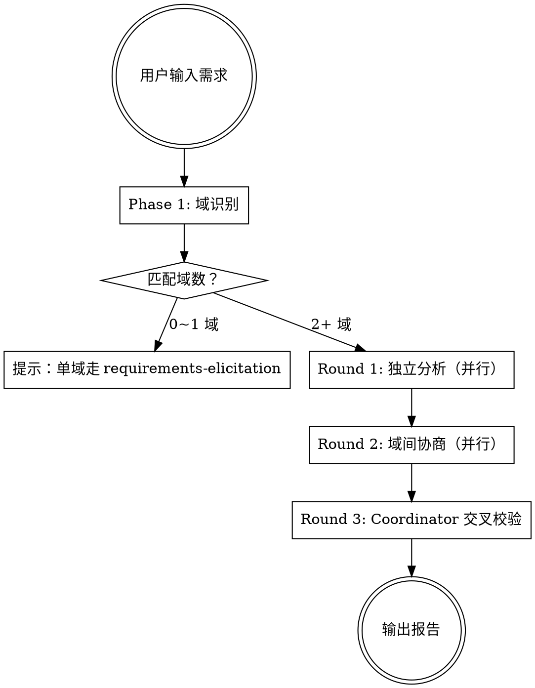

# Domain Collab — 多域协作分析

接收涉及 2+ 域的自然语言需求，并行派发域专属 Agent 进行分析，Coordinator 交叉校验后输出结构化报告。

> **单域需求** 由 `ecw:requirements-elicitation` 处理，本 skill 专注多域场景。

## 触发方式

- **手动**: `/domain-collab <需求或改动描述>`
- **自动识别**: 用户描述业务需求时触发

## 前置步骤

1. 读取 ecw.yml `paths.domain_registry` 指定的文件（默认 `.claude/ecw/domain-registry.md`）获取域定义
2. 确认 ecw.yml `paths.knowledge_common` 下的 `cross-domain-rules.md` 存在

## 流程总览



## Phase 1: 域识别

1. 从项目 CLAUDE.md 的域路由部分（关键词→域映射表）读取关键词，匹配用户输入，识别涉及的域
2. 从 domain-registry 读取匹配域的元数据（知识目录、代码目录等）
3. 判断是否适用：
   - 匹配 0 个域 → 提示用户："无法识别涉及的业务域，请补充描述或指定域名"
   - 匹配 1 个域 → 提示："单域需求建议使用 `/requirements-elicitation`，本 skill 专注多域协作分析"
   - 匹配 2+ 域 → 继续执行协作分析
4. 如果由 risk-classifier 调用并已传入域列表，**跳过确认**，直接执行。
5. 如果手动触发（`/domain-collab`），向用户确认："识别到涉及 {域列表}，将进行多域协作分析。"

---

## 多域协作分析（3 轮）

### Round 1: 独立分析（并行）

为每个匹配到的域派发一个 Agent（使用 Agent tool，`subagent_type: general-purpose`）。

**前置步骤（Coordinator 在派发 Agent 前执行）：** 读取 `.claude/ecw/ecw.yml` 获取 project.name 和 component_types，读取 ecw.yml `paths.domain_registry` 获取域定义。

**所有域 Agent 使用统一的 prompt 模板：**

```
你是 {project_name} {domain_name}域专家 Agent。你的任务是分析一个需求对你负责的域的影响。
（project_name 从 `.claude/ecw/ecw.yml` 读取）

## 你的域信息
- 域ID: {domain_id}
- 域名: {domain_name}
- 职责: {description}

## 你的知识文档
读取入口: {knowledge_root}{index}，从中定位与需求相关的章节。
只读取与需求描述直接相关的知识文件和章节，不要全部读取。
核心文件：{knowledge_root}{business_rules}（状态机和验证规则章节）、{knowledge_root}{data_model}（相关实体）。
{extra_knowledge_lines}

## 代码目录（需要时可以 grep 验证）
- 主目录: {code_root}
{related_code_dirs}

## 需求描述
---
{user_requirement}
---

## 分析要求
1. 基于你的知识文档分析需求对本域的影响
2. 识别需要变更的组件（从 `.claude/ecw/ecw.yml` 的 `component_types` 字段读取可选值）
3. 识别状态流转变化
4. 识别可能影响其他域的风险点
5. 不要猜测，只基于你读到的文档和代码做判断
6. 如果本域完全不受影响，说明原因

## 输出约束
- YAML 块总长度不超过 30 行
- `notes` 字段不超过 2 句话
- 如果 `impact_level` 为 none，只输出 domain + impact_level + summary 三个字段
- 如果无 `state_changes` 或无 `cross_domain_risks`，省略该字段（不要输出空数组）
- 不要输出分析推理过程，只输出结论性 YAML

## 输出格式（严格按此 YAML 格式输出，用 ```yaml 代码块包裹）
domain: {domain_id}
impact_level: none | low | medium | high
summary: "一句话概述需求对本域的影响"
affected_components:
  - type: "从 ecw.yml component_types 读取可选值"
    name: "类名或资源名"
    change: "需要做什么变更"
state_changes:
  - entity: "实体名"
    from: "原状态"
    to: "新状态"
    trigger: "触发条件"
cross_domain_risks:
  - target: "目标域ID"
    type: "direct_call | mq | shared_resource"
    resource: "资源名"
    reason: "为什么可能受影响"
notes: "其他需要注意的事项"
```

**Coordinator 操作步骤：**
1. 从 domain-registry 读取每个匹配域的元数据
2. 用上方模板填充变量，为每个域生成 prompt
3. 使用 Agent tool 并行派发所有域 Agent（在一条消息中发出多个 Agent tool 调用）
4. 收集所有 Agent 返回的 YAML 结果

### Round 2: 域间协商（并行）

Round 1 各域独立分析完成后，Coordinator 把各域的变更计划交叉分发，让每个域评估**其他域的变更**是否影响自己。

**Coordinator 操作步骤：**

1. 收集 Round 1 所有域 agent 的 YAML 输出
2. 为每个域生成一份"其他域变更摘要"——汇总其他所有域的 `affected_components`、`state_changes`、`cross_domain_risks`
3. 特别标注：其他域的 `cross_domain_risks` 中 `target` 指向本域的项（"有域专门提到了你可能受影响"）
4. 并行派发新一轮域 agent

**Round 2 域 Agent 使用统一的 prompt 模板：**

```
你是 {project_name} {domain_name}域专家 Agent（协商轮）。

Round 1 中你对需求做了独立分析，现在其他域也完成了分析。你的任务是评估其他域的变更计划是否影响你的域。

## 原始需求
---
{user_requirement}
---

## 你在 Round 1 的分析结果
{round1_yaml_output}

## 其他域的变更计划（摘要）
{for each other domain:}
### {other_domain_name}域 — {impact_level}
{summary}
变更: {affected_components as comma-separated "type:name" list}
指向你的风险: {cross_domain_risks where target == current domain, one line each, or "无"}

如需验证业务规则，按需读取：{knowledge_root}{business_rules}。
只在其他域变更可能影响本域规则时读取，不要预防性全量读取。

## 协商任务
1. 检查其他域的变更是否影响你的域（接口变更、消息体变更、共享资源变更等）
2. 如果受影响，说明具体影响点和你这边需要的配套变更
3. 如果 Round 1 你报了 impact_level: none，但其他域的变更确实影响了你，更新你的评估
4. 如果发现其他域的变更计划与你的域存在冲突（同时改同一接口、状态机不兼容等），指出冲突点
5. 如果其他域的变更完全不影响你，直接报 revised_impact_level 与 Round 1 一致，其余字段留空

## 输出约束
- YAML 块总长度不超过 20 行
- 如果其他域变更完全不影响本域，只输出 domain + revised_impact_level（与 Round 1 一致）+ 一句话说明
- 不要输出分析推理过程，只输出结论性 YAML

## 输出格式（严格按此 YAML 格式输出，用 ```yaml 代码块包裹）
domain: {domain_id}
negotiation_result:
  revised_impact_level: none | low | medium | high
  impact_from_others:
    - source_domain: "哪个域的变更影响了你"
      impact: "具体影响描述"
      required_action: "你这边需要做的配套变更"
  conflicts:
    - with_domain: "冲突对方域"
      description: "冲突描述"
      suggestion: "建议解决方式"
  revised_components:
    - type: "组件类型"
      name: "类名"
      change: "变更内容"
      reason: "因为哪个域的什么变更导致需要配套改动"
```

**Coordinator 操作步骤：**
1. 用上方模板填充变量，为每个域生成 Round 2 prompt
2. 使用 Agent tool 并行派发所有域 Agent（在一条消息中发出多个 Agent tool 调用）
3. 收集所有 Agent 返回的 YAML 结果

**Round 2 跳过规则**：如果某个域在 Round 1 返回 `impact_level: none` 且没有其他域的 `cross_domain_risks` 指向它，**跳过该域的 Round 2 Agent 派发**。该域不受影响且没有被其他域标记为可能受影响，Round 2 协商不会产生新发现。在 Round 3 交叉校验中标注："域 X 在 Round 1 无影响且无指向风险，Round 2 跳过。"

---

### Round 3: Coordinator 交叉校验与汇总

**Coordinator 自己完成以下步骤（不派发 Agent）：**

**3a. 合并 Round 1 + Round 2 结果**

对每个域：
- 如果 Round 2 的 `revised_impact_level` 高于 Round 1 的 `impact_level` → 以 Round 2 为准
- 把 Round 2 的 `revised_components` 追加到 Round 1 的 `affected_components`
- 把 Round 2 的 `impact_from_others` 加入跨域依赖关系
- 把 Round 2 的 `conflicts` 汇总到冲突列表

**3b. 跨域冲突检测**

遍历合并后所有域的 `cross_domain_risks` + Round 2 的 `conflicts`，检查：
- 是否有两个域对同一资源提出了不兼容的变更 → 标记为"域间冲突"
- 是否有域 A 的 `cross_domain_risks` 指向域 B，但域 B 在 Round 1 和 Round 2 都报了 `none` → 标记为"疑似遗漏"

**3c. 跨域规则校验（遗漏检测）**

读取以下文件做最终校验（按需读取，不要一次全部读取）：
- `cross-domain-calls.md` → 验证各域提到的直接调用关系是否登记
- `mq-topology.md` → 验证各域提到的 MQ 关系是否登记
- `shared-resources.md` → 检查是否有被忽略的共享资源影响

**3d. 代码验证**

对每个 `affected_component` 执行 Grep 验证。从 ecw.yml `component_types` 读取组件类型及其对应的验证模式：
- 服务层组件 → `Grep pattern="class {name}" path=项目根目录`
- 消息队列组件 → `Grep pattern="{name}" path=项目根目录`
- 领域模型组件 → `Grep pattern="class {name}" path=领域模型目录`

标记验证结果：
- 找到 → 已验证
- 未找到 → 文档过期（知识文档说有但代码中找不到）
- 代码中存在但知识文档未提及 → 未登记（建议补充到知识文档）

对每个 `cross_domain_risk`：
- `Grep pattern="{resource}" path=项目根目录` 确认调用关系确实存在

**3e. 输出报告**

1. **将完整报告写入文件** `.claude/plans/domain-collab-report.md`（使用下方完整报告模板）
2. **在对话中只输出摘要版本**（不超过 30 行），包含：
   - 涉及域总览表（域名 + 等级 + 变更组件数 + 一句话概述）
   - 域间冲突（如有）
   - 建议实施顺序
   - 风险点汇总

详细的各域分析、代码验证结果、协商发现等完整内容在文件中查阅。后续 Phase 2 和 writing-plans 直接读取文件获取完整数据。

<details>
<summary>完整报告模板（写入文件时使用）</summary>

```markdown
# 多域协作分析报告

## 需求概述
{user_requirement}

## 涉及域总览（合并 Round 1 + Round 2）
| 域 | Round 1 等级 | 协商后等级 | 变更组件数 | 概述 |
|---|-------------|----------|----------|------|
| {domain_name} | {round1_level} | {final_level} | {count} | {summary} |

## 各域详细分析

### {domain_name}域
**影响等级**: {impact_level}
**概述**: {summary}

**需要变更的组件：**
| 类型 | 名称 | 变更内容 | 验证 |
|------|------|---------|------|
| {type} | {name} | {change} | verified/stale |

**状态变更：**
- {entity}: {from} → {to}（{trigger}）

**跨域风险：**
- → {target}: {reason}（{type}: {resource}）

### （下一个域...）

## 域间协商发现

### 影响等级变更
（如果 Round 2 协商后有域的影响等级升级，列出变更原因）
| 域 | Round 1 等级 | 协商后等级 | 原因 |
|---|-------------|----------|------|
| {domain} | {round1_level} | {round2_level} | {reason} |
（如果所有域等级无变化，显示"无等级变更"）

### 协商发现的配套变更
（Round 2 中各域发现的、因其他域变更而需要的配套改动）
| 域 | 新增组件 | 变更内容 | 触发方 |
|---|---------|---------|--------|
| {domain} | {component} | {change} | {source_domain} 的 {what} 变更 |
（如果无配套变更，显示"无"）

### 域间冲突
（Round 2 协商 + Coordinator 交叉校验发现的冲突）
| 域 A | 域 B | 冲突描述 | 建议 |
|-----|------|---------|------|
| {domain_a} | {domain_b} | {description} | {suggestion} |
（如果无冲突，显示"无"）

## Coordinator 交叉校验发现
### 遗漏检测
- {domain}: 域 A 指出 cross_domain_risk 指向 {domain}，但 {domain} 在 Round 1 和协商轮都报了 none — 建议确认

## 跨域依赖与实施顺序
（根据 cross_domain_risks 的依赖关系，给出建议的实施顺序）
1. 先改 {被依赖域}（被其他域调用/消费）
2. 再改 {依赖域}
3. 最后改 {下游域}

## 代码验证结果
- verified: {name} — 已确认存在
- stale: {name} — 知识文档记录有但代码中未找到，建议确认

## 风险点汇总
- {各域 notes 中的注意事项}
```

</details>

**3f. 写入知识摘要文件**

将本次分析中读取的知识文件关键信息写入 `.claude/ecw/knowledge-summary.md`，供后续 skill（risk-classifier Phase 2、impl-verify Round 2）复用，减少重复读取原始知识文件：

```markdown
# Knowledge Summary（domain-collab 分析提取）

## 涉及域: {域列表}

## 相关共享资源
{从 shared-resources.md 提取的、与本次变更相关的条目}

## 相关跨域调用
{从 cross-domain-calls.md 提取的、涉及变更域的条目}

## 相关 MQ Topic
{从 mq-topology.md 提取的、涉及变更域的条目}

## 相关业务规则摘要
{每个涉及域的 business-rules.md 中与本次变更相关的状态机和验证规则摘要}
```

---

---

## 兜底逻辑

如果所有域 Agent 返回 `impact_level: none`：

1. 检查用户输入是否涉及共享层关键词：
   - `CoreBizService`, `Manager`, `common`, `infra`, `util`, `share`
2. 如果涉及：
   - 读取 `shared-resources.md`，查找相关共享资源的所有使用方域
   - 输出警告："此改动不属于特定业务域，但涉及共享资源 {resource}，被 {域列表} 使用，建议逐一确认影响"
3. 如果不涉及：
   - 输出："分析完成，未发现业务域影响。此改动可能是纯技术改造。"

---

## 后续衔接：risk-classifier Phase 2

**协作分析报告输出后，立即执行 risk-classifier Phase 2（精确定级）。**

Phase 2 会基于本 skill 产出的协作分析报告（各域 `affected_components`、`cross_domain_risks`、Coordinator 交叉校验发现）重新评估风险等级。Phase 2 完成后再进入 `writing-plans`。

**不要跳过 Phase 2 直接进入 writing-plans** — 协作分析可能发现 Phase 1 未预见的跨域依赖，导致等级需要升级。

衔接流程：
```
ecw:domain-collab 报告 → risk-classifier Phase 2 → writing-plans → [P0/P1跨域: ecw:spec-challenge] → 实现
```

---

## 注意事项

- 每轮 Agent 派发使用 Agent tool 的并行调用（单条消息多个 Agent tool call）
- Agent prompt 中的变量用 domain-registry 的数据填充
- 代码验证使用 Grep tool，不使用 bash grep
- 跨域规则文件按需读取，不要一次全部读入
- 分析结果中的每个跨域风险都要标注来源（知识文档 / 跨域规则 / 代码扫描）
