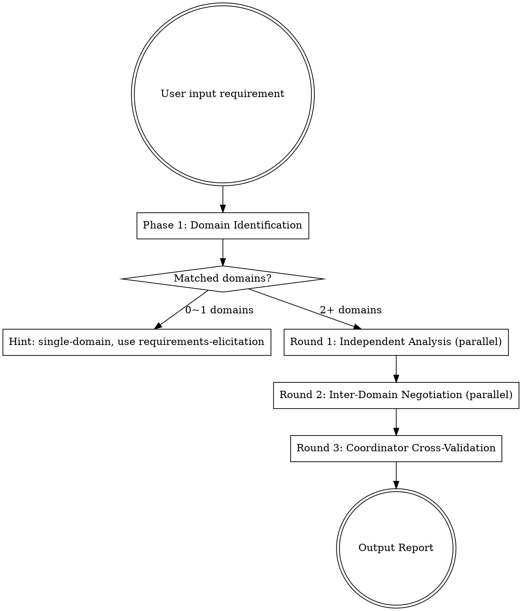

# Domain Collab — Multi-Domain Collaboration Analysis

Accepts natural language requirements spanning 2+ domains, dispatches domain-specific Agents in parallel for analysis, and outputs a structured report after Coordinator cross-validation.

> **Single-domain requirements** are handled by `ecw:requirements-elicitation`. This skill focuses on multi-domain scenarios.

## Trigger

- **Manual**: `/domain-collab <requirement or change description>`
- **Auto-detect**: Triggered when user describes a business requirement

## Prerequisites

1. Read the file specified by ecw.yml `paths.domain_registry` (default `.claude/ecw/domain-registry.md`) to get domain definitions
2. Confirm `cross-domain-rules.md` exists under ecw.yml `paths.knowledge_common`

> **Knowledge file robustness**: If `domain-registry.md` does not exist, halt and notify user: "Domain registry not found. Run `/ecw-init` to initialize." If `cross-domain-rules.md` does not exist, log `[Warning: cross-domain-rules.md not found, Round 3 cross-validation will be degraded]` and continue — Round 3 §3c will skip rule validation for missing files.

## Workflow Overview



## Phase 1: Domain Identification

1. Read keywords from project CLAUDE.md domain routing section (keyword→domain mapping table), match against user input, identify involved domains
2. Read matched domain metadata from domain-registry (knowledge directory, code directory, etc.)
3. Determine applicability:
   - 0 domains matched → Prompt user: "Cannot identify involved business domains. Please add more description or specify domain names"
   - 1 domain matched → Prompt: "Single-domain requirement — suggest using `/requirements-elicitation`. This skill focuses on multi-domain collaboration analysis"
   - 2+ domains matched → Proceed with collaboration analysis
4. If called by risk-classifier with domain list already provided, **skip confirmation** and execute directly.
5. If manually triggered (`/domain-collab`), confirm with user: "Identified domains: {domain list}. Will proceed with multi-domain collaboration analysis."

---

## Multi-Domain Collaboration Analysis (3 Rounds)

### Round 1: Independent Analysis (parallel)

Dispatch one Agent per matched domain (using Agent tool, `subagent_type: general-purpose`).

**Model selection**: `model: sonnet` (domain analysis requires deep understanding of business rules and knowledge files). Exception: if Phase 1 or prior context strongly predicts a domain's `impact_level: none`, use `model: haiku` for that domain to reduce cost.

**Prerequisites (Coordinator executes before dispatching Agents):** Read `.claude/ecw/ecw.yml` to get project.name and component_types; read the file at ecw.yml `paths.domain_registry` to get domain definitions.

**All domain Agents use the prompt template defined in `agents/domain-analyst.md`.** Coordinator fills the template variables with domain-registry data.

```
You are a {project_name} {domain_name} domain expert Agent. Your task is to analyze the impact of a requirement on your responsible domain.
(project_name read from `.claude/ecw/ecw.yml`)

## Your Domain Info
- Domain ID: {domain_id}
- Domain Name: {domain_name}
- Responsibilities: {description}

## Your Knowledge Documents
Read entry point: {knowledge_root}{index}. From there, locate sections relevant to the requirement.
Only read knowledge files and sections directly relevant to the requirement description — do not read everything.
Core files: {knowledge_root}{business_rules} (state machine and validation rules sections), {knowledge_root}{data_model} (related entities).
{extra_knowledge_lines}

## Code Directory (grep to verify when needed)
- Main directory: {code_root}
{related_code_dirs}

## Requirement Description
---
{user_requirement}
---

## Analysis Requirements
1. Analyze the requirement's impact on this domain based on your knowledge documents
2. Identify components that need changes (read available values from `.claude/ecw/ecw.yml` `component_types` field)
3. Identify state transition changes
4. Identify risk points that may affect other domains
5. Do not guess — only make judgments based on documents and code you have read
6. If this domain is completely unaffected, explain why

## Output Constraints
- YAML block total length no more than 30 lines
- `notes` field no more than 2 sentences
- If `impact_level` is none, only output domain + impact_level + summary (three fields)
- If no `state_changes` or no `cross_domain_risks`, omit that field (do not output empty arrays)
- Do not output analysis reasoning process — only output conclusive YAML

## Output Format (strictly follow this YAML format, wrapped in ```yaml code block)
domain: {domain_id}
impact_level: none | low | medium | high
summary: "One-sentence summary of requirement impact on this domain"
affected_components:
  - type: "Read available values from ecw.yml component_types"
    name: "Class name or resource name"
    change: "What change is needed"
state_changes:
  - entity: "Entity name"
    from: "Original state"
    to: "New state"
    trigger: "Trigger condition"
cross_domain_risks:
  - target: "Target domain ID"
    type: "direct_call | mq | shared_resource"
    resource: "Resource name"
    reason: "Why it may be affected"
notes: "Other things to note"
```

**Coordinator operation steps:**
1. Read each matched domain's metadata from domain-registry
2. Fill the template above with variables to generate a prompt for each domain
3. Use Agent tool to dispatch all domain Agents in parallel (multiple Agent tool calls in a single message)
4. Collect all Agent YAML results
5. **Return value validation**: For each domain agent, verify the YAML contains required fields (`domain`, `impact_level`, `summary`). If a domain agent returns invalid format:
   - Log to Ledger: `[FAILED: domain-collab R1 {domain}, reason: invalid return format]`
   - Retry once with the same model
   - If retry also fails: mark that domain as `[incomplete: {domain}, format error]` and continue with remaining domains
6. **Ledger update**: Append records to `.claude/ecw/session-state.md` Subagent Ledger table (one row per domain Agent): `| domain-collab R1 | {domain name} | general | medium | {HH:mm} | {duration} |`. Scale reference: small (<20K tokens), medium (20-80K), large (>80K); domain analysis R1 is typically medium. Note time before dispatch and compute duration after return.

**Timeout per Agent**: 180s. If a domain Agent has not returned within this time, terminate it and mark that domain as `[timeout, analysis unavailable]`.

**Round 1 Checkpoint**: After collecting all Round 1 YAML results, write them to `.claude/ecw/session-data/{workflow-id}/domain-collab-r1.md` (resolve `{workflow-id}` from session-state.md; fall back to `session-data/domain-collab-r1.md` if absent) (one YAML block per domain). This ensures Round 1 results survive context compaction before Round 2 begins.

### Round 2: Inter-Domain Negotiation (parallel)

After Round 1 independent analysis completes, Coordinator distributes each domain's change plan to others, letting each domain assess whether **other domains' changes** affect them.

**Coordinator operation steps:**

1. Collect Round 1 YAML output from all domain agents
2. For each domain, generate an "other domains' changes summary" — aggregate all other domains' `affected_components`, `state_changes`, `cross_domain_risks`
3. Specifically flag: other domains' `cross_domain_risks` where `target` points to this domain ("another domain specifically noted you may be affected")
4. Dispatch new round of domain agents in parallel

**Model selection**: `model: sonnet` (negotiation requires understanding other domains' changes and assessing cross-domain impact). Domains that were `impact_level: none` in Round 1 and had no inbound risks are skipped entirely (see skip rule below).

**Round 2 domain Agents use the prompt template defined in `agents/domain-negotiator.md`.** Coordinator fills the template variables with Round 1 results and other domains' change summaries.

```
You are a {project_name} {domain_name} domain expert Agent (negotiation round).

In Round 1 you performed independent analysis of the requirement. Now other domains have also completed their analysis. Your task is to assess whether other domains' change plans affect your domain.

## Original Requirement
---
{user_requirement}
---

## Your Round 1 Analysis Result
{round1_yaml_output}

## Other Domains' Change Plans (Summary)
{for each other domain:}
### {other_domain_name} Domain — {impact_level}
{summary}
Changes: {affected_components as comma-separated "type:name" list}
Risks pointing to you: {cross_domain_risks where target == current domain, one line each, or "None"}

If you need to verify business rules, read as needed: {knowledge_root}{business_rules}.
Only read when other domains' changes may affect your domain's rules — do not preemptively read everything.

## Negotiation Task
1. Check if other domains' changes affect your domain (interface changes, message body changes, shared resource changes, etc.)
2. If affected, describe the specific impact point and the companion changes needed on your side
3. If you reported impact_level: none in Round 1, but other domains' changes do affect you, update your assessment
4. If you discover conflicts between other domains' change plans and your domain (modifying same interface simultaneously, incompatible state machines, etc.), flag the conflict points
5. If other domains' changes have zero impact on you, simply report revised_impact_level matching Round 1, leave other fields empty

## Output Constraints
- YAML block total length no more than 20 lines
- If other domains' changes have zero impact on this domain, only output domain + revised_impact_level (matching Round 1) + one-sentence explanation
- Do not output analysis reasoning process — only output conclusive YAML

## Output Format (strictly follow this YAML format, wrapped in ```yaml code block)
domain: {domain_id}
negotiation_result:
  revised_impact_level: none | low | medium | high
  impact_from_others:
    - source_domain: "Which domain's changes affected you"
      impact: "Specific impact description"
      required_action: "Companion changes needed on your side"
  conflicts:
    - with_domain: "Conflicting domain"
      description: "Conflict description"
      suggestion: "Suggested resolution"
  revised_components:
    - type: "Component type"
      name: "Class name"
      change: "Change content"
      reason: "What change from which domain necessitates this companion change"
```

**Coordinator operation steps:**
1. Fill the template above with variables to generate Round 2 prompt for each domain
2. Use Agent tool to dispatch all domain Agents in parallel (multiple Agent tool calls in a single message)
3. Collect all Agent YAML results
4. **Return value validation**: For each domain agent, verify the YAML contains required fields (`domain`, `negotiation_result.revised_impact_level`). If a domain agent returns invalid format:
   - Log to Ledger: `[FAILED: domain-collab R2 {domain}, reason: invalid return format]`
   - Retry once with the same model
   - If retry also fails: use Round 1 result unchanged for that domain, mark as `[incomplete: {domain} R2, format error]`
5. **Ledger update**: Append records to `.claude/ecw/session-state.md` Subagent Ledger table (one row per domain Agent): `| domain-collab R2 | {domain name} | general | small | {HH:mm} | {duration} |`. Domain negotiation R2 is typically small. Note time before dispatch and compute duration after return.

**Timeout per Agent**: 120s (Round 2 is lighter than Round 1). If a domain Agent times out, use its Round 1 result unchanged.

**Round 2 Checkpoint**: After collecting all Round 2 YAML results, write them to `.claude/ecw/session-data/{workflow-id}/domain-collab-r2.md` (resolve `{workflow-id}` from session-state.md; fall back to `session-data/domain-collab-r2.md` if absent). This ensures negotiation results survive context compaction before Round 3 cross-validation.

**Round 2 skip rule**: If a domain returned `impact_level: none` in Round 1 AND no other domain's `cross_domain_risks` points to it, **skip Round 2 Agent dispatch for that domain**. That domain is unaffected and no other domain flagged it as potentially affected — Round 2 negotiation would not produce new findings. Note in Round 3 cross-validation: "Domain X had no impact in Round 1 and no inbound risks; Round 2 skipped."

---

### Round 3: Coordinator Cross-Validation & Summary

**Coordinator completes the following steps itself (no Agent dispatch):**

**3a. Merge Round 1 + Round 2 Results**

For each domain:
- If Round 2's `revised_impact_level` is higher than Round 1's `impact_level` → Use Round 2 value
- Append Round 2's `revised_components` to Round 1's `affected_components`
- Add Round 2's `impact_from_others` to cross-domain dependency relationships
- Aggregate Round 2's `conflicts` into conflict list

**3b. Cross-Domain Conflict Detection**

Traverse all domains' merged `cross_domain_risks` + Round 2 `conflicts`, check:
- Do two domains propose incompatible changes to the same resource → Flag as "inter-domain conflict"
- Does domain A's `cross_domain_risks` point to domain B, but domain B reported `none` in both Round 1 and Round 2 → Flag as "suspected omission"

**3c. Cross-Domain Rule Validation (Omission Detection)**

Read the following files for final validation (read as needed, not all at once):
- `cross-domain-calls.md` → Verify whether direct call relationships mentioned by each domain are registered
- `mq-topology.md` → Verify whether MQ relationships mentioned by each domain are registered
- `shared-resources.md` → Check for overlooked shared resource impacts

> **Knowledge file robustness**: For each file, verify existence before reading. If a file is missing, skip that dimension's validation and note `[Warning: {file} not found, {dimension} validation skipped]` in the report. Do not halt Round 3 for missing knowledge files.

**3d. Code Verification**

For each `affected_component`, execute Grep verification. Read component types and their corresponding verification patterns from ecw.yml `component_types`:
- Service-layer components → `Grep pattern="class {name}" path=project root`
- Message queue components → `Grep pattern="{name}" path=project root`
- Domain model components → `Grep pattern="class {name}" path=domain model directory`

Tag verification results:
- Found → verified
- Not found → stale (knowledge docs say it exists but not found in code)
- Exists in code but not mentioned in knowledge docs → unregistered (suggest adding to knowledge docs)

For each `cross_domain_risk`:
- `Grep pattern="{resource}" path=project root` to confirm call relationship actually exists

**3e. Output Report**

1. **Write full report to file** `.claude/plans/domain-collab-report.md` (using the full report template below)
2. **Output only summary version in conversation** (no more than 30 lines), including:
   - Domain overview table (domain name + level + changed component count + one-line summary)
   - Inter-domain conflicts (if any)
   - Suggested implementation order
   - Risk point summary

Detailed per-domain analysis, code verification results, negotiation findings, etc. are in the file. Subsequent Phase 2 and ecw:writing-plans read the file directly for full data.

<details>
<summary>Full Report Template (used when writing to file)</summary>

```markdown
# Multi-Domain Collaboration Analysis Report

## Requirement Summary
{user_requirement}

## Domain Overview (Merged Round 1 + Round 2)
| Domain | Round 1 Level | Post-Negotiation Level | Changed Components | Summary |
|--------|--------------|----------------------|-------------------|---------|
| {domain_name} | {round1_level} | {final_level} | {count} | {summary} |

## Per-Domain Detailed Analysis

### {domain_name} Domain
**Impact Level**: {impact_level}
**Summary**: {summary}

**Components to Change:**
| Type | Name | Change Content | Verification |
|------|------|---------------|-------------|
| {type} | {name} | {change} | verified/stale |

**State Changes:**
- {entity}: {from} → {to} ({trigger})

**Cross-Domain Risks:**
- → {target}: {reason} ({type}: {resource})

### (next domain...)

## Inter-Domain Negotiation Findings

### Impact Level Changes
(If any domain's impact level upgraded after Round 2 negotiation, list the change reason)
| Domain | Round 1 Level | Post-Negotiation Level | Reason |
|--------|--------------|----------------------|--------|
| {domain} | {round1_level} | {round2_level} | {reason} |
(If all domain levels unchanged, show "No level changes")

### Companion Changes Discovered in Negotiation
(Changes each domain discovered in Round 2 that are needed due to other domains' changes)
| Domain | New Component | Change Content | Triggered By |
|--------|--------------|---------------|-------------|
| {domain} | {component} | {change} | {source_domain}'s {what} change |
(If no companion changes, show "None")

### Inter-Domain Conflicts
(Conflicts found in Round 2 negotiation + Coordinator cross-validation)
| Domain A | Domain B | Conflict Description | Suggestion |
|----------|----------|---------------------|------------|
| {domain_a} | {domain_b} | {description} | {suggestion} |
(If no conflicts, show "None")

## Coordinator Cross-Validation Findings
### Omission Detection
- {domain}: Domain A flagged cross_domain_risk pointing to {domain}, but {domain} reported none in both Round 1 and negotiation — suggest confirming

## Cross-Domain Dependencies & Implementation Order
(Based on cross_domain_risks dependency relationships, suggest implementation order)
1. First modify {depended-upon domain} (called/consumed by other domains)
2. Then modify {dependent domain}
3. Finally modify {downstream domain}

## Code Verification Results
- verified: {name} — confirmed to exist
- stale: {name} — knowledge docs record it but not found in code, suggest confirming

## Risk Point Summary
- {notes from each domain}
```

</details>

**3f. Write Knowledge Summary File**

Write key information from knowledge files read during this analysis to `.claude/ecw/knowledge-summary.md` for reuse by downstream skills (risk-classifier Phase 2, impl-verify Round 2), reducing redundant reads of original knowledge files:

```markdown
# Knowledge Summary (extracted during domain-collab analysis)

## Involved Domains: {domain list}

## Related Shared Resources
{Entries extracted from shared-resources.md relevant to this change}

## Related Cross-Domain Calls
{Entries extracted from cross-domain-calls.md involving changed domains}

## Related MQ Topics
{Entries extracted from mq-topology.md involving changed domains}

## Related Business Rules Summary
{For each involved domain: summary of state machines and validation rules from business-rules.md relevant to this change}
```

---

---

## Fallback Logic

If all domain Agents return `impact_level: none`:

1. Check if user input involves shared-layer keywords:
   - `CoreBizService`, `Manager`, `common`, `infra`, `util`, `share`
2. If yes:
   - Read `shared-resources.md`, find all consumer domains for the related shared resource
   - Output warning: "This change does not belong to a specific business domain, but involves shared resource {resource} used by {domain list}. Suggest confirming impact on each."
3. If no:
   - Output: "Analysis complete. No business domain impact detected. This change may be a pure technical refactoring."

---

## Downstream Handoff: risk-classifier Phase 2

**P0/P1**: After collaboration analysis report is output, immediately execute risk-classifier Phase 2 (precise classification). Phase 2 will re-assess risk level based on this skill's collaboration analysis report (per-domain `affected_components`, `cross_domain_risks`, Coordinator cross-validation findings). Proceed to `ecw:writing-plans` after Phase 2 completes.

**P2**: Skip Phase 2 (Phase 1 lightweight check already covered), proceed directly to `ecw:writing-plans`.

**Do not skip Phase 2 for P0/P1 and go directly to writing-plans** — collaboration analysis may discover cross-domain dependencies not foreseen in Phase 1, requiring level upgrade.

Handoff flow:
```
P0/P1: ecw:domain-collab report → risk-classifier Phase 2 → ecw:writing-plans → [P0/P1 cross-domain: ecw:spec-challenge] → Implementation
P2:    ecw:domain-collab report → ecw:writing-plans → Implementation → ecw:impl-verify → ecw:biz-impact-analysis (suggested)
```

**Context management**: After Round 3 output is complete and files are written, suggest to the user: "domain-collab analysis is complete and saved to files. Consider running `/compact` to free context for the next phase (writing-plans)." This is a suggestion, not a requirement — only output it if the analysis was complex (3+ domains or Round 2 had conflicts).

---

## Error Handling

| Scenario | Handling |
|----------|---------|
| Round 1/2 domain Agent returns empty or malformed YAML | Record `FAILED` in Subagent Ledger → retry once with explicit "return YAML only" instruction → still fails: mark domain as `[analysis unavailable]` and continue with remaining domains |
| All domain Agents fail in a Round | Notify user: "Domain analysis agents failed. Provide manual domain impact assessment or retry." Do not proceed to next Round |
| Knowledge file missing (`domain-registry.md`, `cross-domain-rules.md`, per-domain knowledge) | Log `[Warning: {file} not found, analysis degraded]` → continue with available data. If `domain-registry.md` missing: halt and ask user to run `/ecw-init` |
| Report file write failure (`domain-collab-report.md`, `knowledge-summary.md`) | Retry once → still fails: output full report content in conversation so downstream skills can reference it |

## Notes

- Each round of Agent dispatch uses Agent tool's parallel calls (multiple Agent tool calls in a single message)
- Agent prompt variables are filled with domain-registry data
- Code verification uses Grep tool, not bash grep
- Cross-domain rule files are read as needed — do not load all at once
- Every cross-domain risk in analysis results must be tagged with source (knowledge docs / cross-domain rules / code scan)
