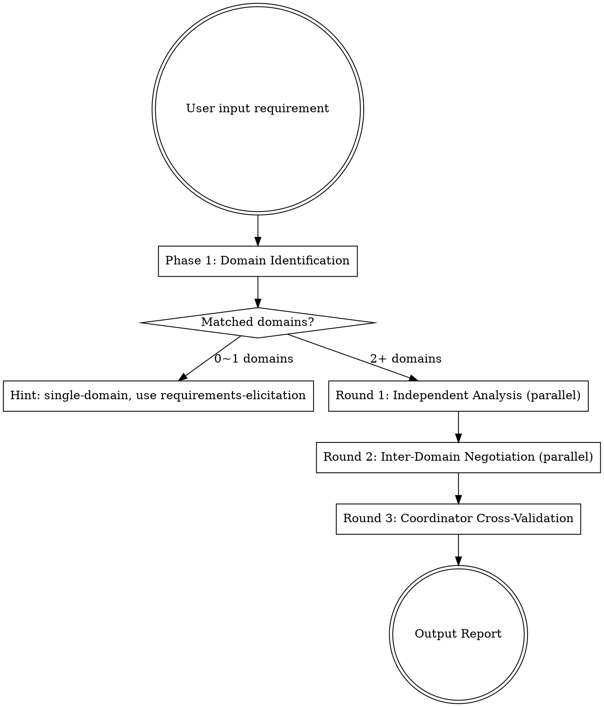

# Domain Collab — Workflow Diagram

```dot
digraph domain_collab {
  rankdir=TB;

  "User input requirement" [shape=doublecircle];
  "Phase 1: Domain Identification" [shape=box];
  "Matched domains?" [shape=diamond];
  "Hint: single-domain, use requirements-elicitation" [shape=box];
  "Round 1: Independent Analysis (parallel)" [shape=box];
  "Round 2: Inter-Domain Negotiation (parallel)" [shape=box];
  "Round 3: Coordinator Cross-Validation" [shape=box];
  "Output Report" [shape=doublecircle];

  "User input requirement" -> "Phase 1: Domain Identification";
  "Phase 1: Domain Identification" -> "Matched domains?";
  "Matched domains?" -> "Hint: single-domain, use requirements-elicitation" [label="0~1 domains"];
  "Matched domains?" -> "Round 1: Independent Analysis (parallel)" [label="2+ domains"];
  "Round 1: Independent Analysis (parallel)" -> "Round 2: Inter-Domain Negotiation (parallel)";
  "Round 2: Inter-Domain Negotiation (parallel)" -> "Round 3: Coordinator Cross-Validation";
  "Round 3: Coordinator Cross-Validation" -> "Output Report";
}
```
