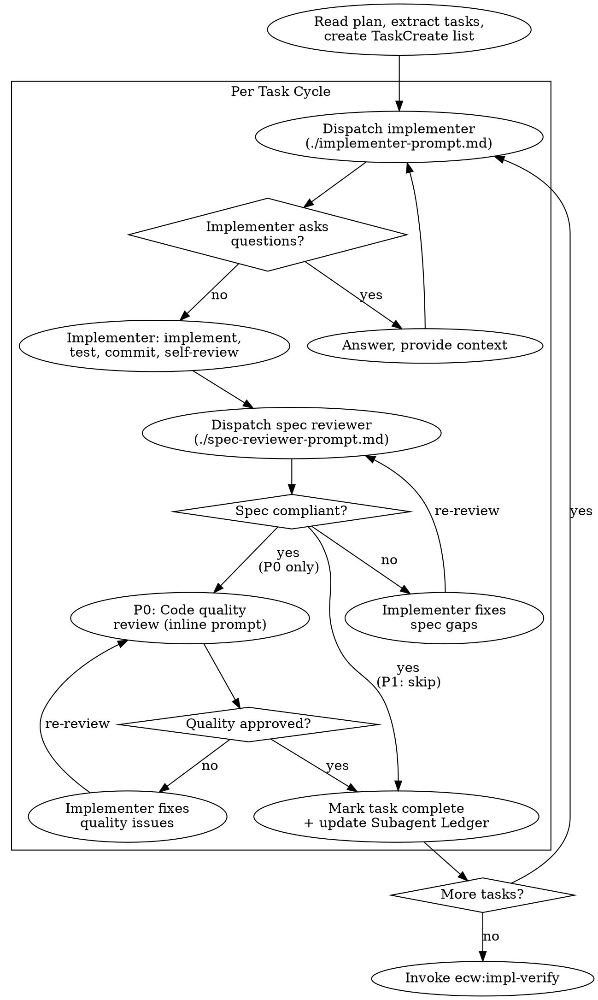

# Implementation Orchestration

Execute plan by dispatching fresh subagent per task, with risk-aware review gates after each.

**Why subagents:** Delegate tasks to specialized agents with isolated context. Precisely craft their instructions — they never inherit your session context. This preserves your context for coordination work.

**Core principle:** Fresh subagent per task + risk-aware review = high quality, fast iteration.

**Announce at start:** "Using ecw:impl-orchestration to execute the plan task-by-task."

## When to Use

Use when:
- You have an implementation plan (from `ecw:writing-plans`)
- Tasks are mostly independent
- `session-state.md` `实现策略` = `subagent-driven`, OR Task count x risk level matches subagent-driven criteria per risk-classifier

Don't use when:
- No plan exists (write one first)
- Tasks are tightly coupled (implement directly)
- P2 / P3 / simple changes (implement directly)

## Risk-Aware Review Depth

Read `.claude/ecw/session-state.md` for risk level. If unavailable, use AskUserQuestion to ask the user for risk level (P0 or P1).

| Risk Level | Per-task Spec Review | Per-task Code Quality Review | Post-impl |
|-----------|---------------------|----------------------------|-----------|
| **P0** | Mandatory | Mandatory (simplified inline) | ecw:impl-verify (full 4 Rounds) |
| **P1** | Mandatory | **Skip** (impl-verify Round 4 covers this) | ecw:impl-verify (full 4 Rounds) |
| **P2** | Not applicable (P2 doesn't use orchestration) | — | ecw:impl-verify |

**Why P0 keeps code quality review:** Error cost at P0 is extreme. Catching issues per-task is cheaper than finding them across the full implementation.

**Why P1 skips code quality review:** impl-verify Round 4 (engineering standards) provides the same checks with full implementation context, avoiding duplicate work.

## The Process



## Setup

1. **Read plan file once** — extract all tasks with full text
2. **Create TaskCreate list** — one Task per plan task, with dependency chain
3. **Note context** — architectural decisions, domain constraints, file structure

## Per-Task Cycle

### 1. Dispatch Implementer

Use `./implementer-prompt.md` template. Inject:
- Full task text (don't make subagent read plan file)
- Scene-setting context (where this fits, dependencies)
- ECW domain context (domain name, knowledge file paths, risk level)
- TDD requirement (if `tdd.enabled` in ecw.yml)
- Working directory

Use Agent tool with `subagent_type: "general-purpose"`.

**Model selection:**
- Mechanical tasks (1-2 files, clear spec) → `model: "sonnet"`
- Integration tasks (multi-file, judgment needed) → default model
- Architecture/design tasks → `model: "opus"`

### 2. Handle Implementer Status

**DONE:** Proceed to spec review.

**DONE_WITH_CONCERNS:** Read concerns. If about correctness/scope, address before review. If observations, note and proceed.

**NEEDS_CONTEXT:** Provide missing context and re-dispatch.

**BLOCKED:** Assess:
1. Context problem → provide more context, re-dispatch
2. Task too hard → re-dispatch with more capable model
3. Task too large → break into smaller pieces
4. Plan wrong → use AskUserQuestion to discuss with user

**Never** ignore escalation or force same model to retry without changes.

### 3. Spec Compliance Review

Use `./spec-reviewer-prompt.md` template. Inject:
- Full task requirements
- Implementer's report

The reviewer reads actual code and verifies:
- Missing requirements
- Extra/unneeded work
- Misunderstandings

If issues found → implementer fixes → re-review. Repeat until approved.

### 4. Code Quality Review (P0 Only)

For P0 risk level, after spec compliance passes, dispatch a code quality review:

```
Agent(description: "Code quality review for Task N"):
  Review the implementation for Task N.

  Files changed: [list from implementer report]

  Check:
  - Each file has one clear responsibility
  - Units decomposed for independent testing
  - Following file structure from plan
  - Clean, maintainable code
  - Names clear and accurate
  - No overbuilding (YAGNI)
  - Tests verify behavior (not mock behavior)

  Report: Strengths, Issues (Critical/Important/Minor), Assessment (Approved/Needs Fix)
```

If issues found → implementer fixes → re-review.

### 5. Complete Task

- Mark task complete in TaskUpdate
- Update Subagent Ledger in `session-state.md` (P0 记录全部三行；P1 仅记录 implementer + spec-reviewer，跳过 code-quality)：

```markdown
| {task_name} | implementer | {model} | — |
| {task_name} | spec-reviewer | {model} | — |
| {task_name} | code-quality | {model} | — |  ← P0 only
```

## After All Tasks

**Do NOT dispatch a final code reviewer.** ECW uses `ecw:impl-verify` (4-Round multi-dimensional verification) which is more comprehensive.

1. Invoke `ecw:impl-verify` — this is the post-implementation quality gate
2. impl-verify handles: requirements alignment, domain rule compliance, plan consistency, engineering standards

## Never Rules

- Start implementation on main/master without explicit user consent
- Skip spec compliance review
- Proceed with unfixed spec issues
- Dispatch multiple implementation subagents in parallel (conflicts)
- Make subagent read plan file (provide full text)
- Skip scene-setting context
- Ignore subagent questions
- Accept "close enough" on spec compliance
- Skip review loops (issues found = fix = re-review)
- Let self-review replace actual review (both needed)
- **Start code quality review before spec compliance passes** (wrong order)
- Move to next task while review has open issues
- **Skip fact-forcing gate** — implementers must quote task requirements before editing and check cross-domain file ownership

## Task Merging

If plan has many small tasks, consider merging per risk-classifier rules:
- Single-file + no conditional branch logic = can merge
- State machine / cross-domain / multi-file = must stay independent

Reference risk-classifier "实现策略选择" section for authoritative rules. Do not redefine here.
