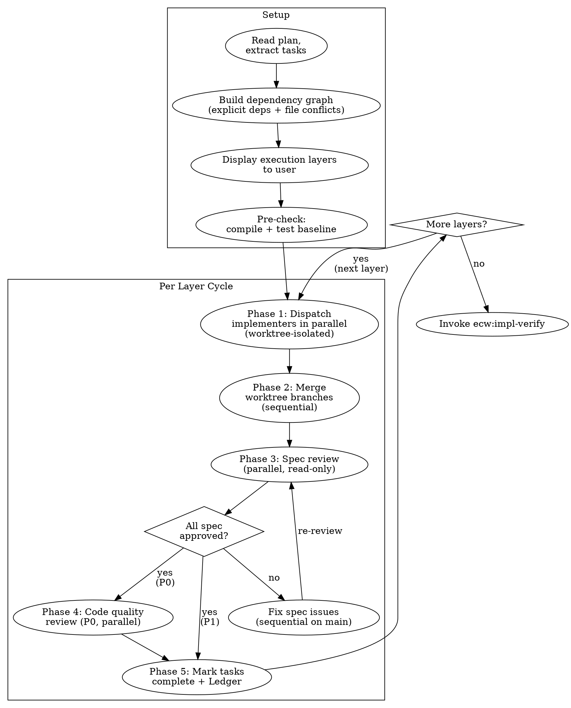

# Implementation Orchestration — Process Diagram

```dot
digraph process {
    rankdir=TB;

    subgraph cluster_setup {
        label="Setup";
        read_plan [label="Read plan,\nextract tasks"];
        build_graph [label="Build dependency graph\n(explicit deps + file conflicts)"];
        show_layers [label="Display execution layers\nto user"];
        precheck [label="Pre-check:\ncompile + test baseline"];
        read_plan -> build_graph -> show_layers -> precheck;
    }

    subgraph cluster_layer {
        label="Per Layer Cycle";
        dispatch_parallel [label="Phase 1: Dispatch\nimplementers in parallel\n(worktree-isolated)"];
        merge [label="Phase 2: Merge\nworktree branches\n(sequential)"];
        review_parallel [label="Phase 3: Spec review\n(parallel, read-only)"];
        fix_issues [label="Fix spec issues\n(sequential on main)"];
        review_ok [label="All spec\napproved?" shape=diamond];
        code_quality [label="Phase 4: Code quality\nreview (P0, parallel)"];
        complete_layer [label="Phase 5: Mark tasks\ncomplete + Ledger"];

        dispatch_parallel -> merge -> review_parallel -> review_ok;
        review_ok -> fix_issues [label="no"];
        fix_issues -> review_parallel [label="re-review"];
        review_ok -> code_quality [label="yes\n(P0)"];
        review_ok -> complete_layer [label="yes\n(P1)"];
        code_quality -> complete_layer;
    }

    more [label="More layers?" shape=diamond];
    impl_verify [label="Invoke ecw:impl-verify"];

    precheck -> dispatch_parallel;
    complete_layer -> more;
    more -> dispatch_parallel [label="yes\n(next layer)"];
    more -> impl_verify [label="no"];
}
```
