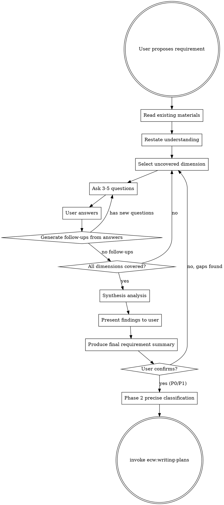

# Requirements Elicitation

## Overview

When user proposes a requirement, **do NOT** jump straight to implementation. Instead, act as a senior business analyst: read existing materials first, then systematically ask questions dimension by dimension until both sides reach full consensus on what to build.

**Core Principle:** Every question you don't ask now becomes a future bug, rework, or misunderstanding. Ask more now, change less later.

## When to Use

- User proposes a new feature or requirement
- User describes a business need or change request
- User says "I want to...", "We need to...", "Add a feature..."
- User provides a PRD, specification, or requirement document for implementation

**Prerequisite:** This skill is no longer triggered directly. All change-type tasks enter through `ecw:risk-classifier`, which decides whether to invoke this skill based on risk level and domain count:
- P0/P1 single-domain → ecw:risk-classifier invokes this skill (full workflow)
- P0/P1 cross-domain → ecw:risk-classifier invokes `ecw:domain-collab` (replaces this skill)
- P2 → ecw:risk-classifier skips this skill, goes directly to ecw:writing-plans (1-round simplified confirmation)
- P3 → Skip this skill, implement directly

If ecw:risk-classifier has not yet executed, **execute ecw:risk-classifier first**, then let it decide whether to invoke this skill.

**When NOT to use:**
- User gives a precise, fully-specified technical task ("fix the null pointer on line 42")
- User explicitly says "just do it, don't ask questions"
- **Bug fix / debugging scenarios** — bug fixes still go through `ecw:risk-classifier` for risk pre-assessment first, then route to `ecw:systematic-debugging` for diagnosis and fix; they do not go through this skill
- Changes classified as P2 or P3 by ecw:risk-classifier

## Skill Handoff

**After user confirms the requirement summary, execute the following handoff steps:**

1. **P0/P1 requirements**: First execute **ecw:risk-classifier Phase 2** (precise classification). Phase 2 will re-assess risk level and impact scope based on the requirement summary produced by this skill, potentially upgrading/downgrading and adjusting downstream workflow. After Phase 2 completes, invoke `ecw:writing-plans`.
2. **P2 requirements** (should not reach this skill, but as fallback): Directly invoke `ecw:writing-plans`.

**Do not skip Phase 2 and go directly to ecw:writing-plans** — Phase 2 is a mandatory node between requirement analysis completion and plan writing.

## Core Flow



## Step-by-Step Process

### Step 1: Read Existing Materials

Before asking questions:
- Read relevant source code, configuration, database schema
- Read existing documentation, PRDs, READMEs
- Understand current behavior and data model
- Note what already exists vs. what is new

### Step 2: Restate Understanding

Tell the user your understanding of their requirement in 2-3 sentences. This immediately catches major misunderstandings.

### Step 3: Systematic Questioning

Ask **3-5 questions** per round. Each answer may trigger follow-ups. Use the checklist below to track which dimensions have been covered.

**Key: Do not stop after one round.** Continue asking until all relevant dimensions have been explored. Every user answer opens new questions.

**Per-round checkpoint**: After each Q&A round completes (user answers all questions), append the round summary to `.claude/ecw/session-data/requirements-summary.md`:
```markdown
### Round {N} — {covered dimensions}
**Questions**: {list of questions asked}
**Answers**: {summary of user answers}
**Follow-ups identified**: {list, or "none"}
**Dimensions remaining**: {uncovered dimensions}
```
This incremental append ensures Q&A history survives context compaction during long elicitation sessions.

### Step 4: Synthesis Analysis

After all Q&A rounds complete, use the Agent tool to launch **one agent** (`model: sonnet` — synthesis requires cross-referencing multiple Q&A rounds and identifying contradictions):

**Prompt:**
```
You are a senior business analyst with critical review capability. Based on the following requirement Q&A, analyze from two perspectives:

## Perspective 1: Business Completeness
- Is the business logic complete? What workflow steps are missing?
- Are state transitions clear? Any undefined state jumps?
- Are there gaps in business rules?

## Perspective 2: Adversarial Review
- Are there contradictions between answers?
- What boundary scenarios are uncovered?
- Where might rules conflict with each other?
- What complexity did the user gloss over?

List findings from both perspectives separately. Tag each finding with severity (critical/important/suggestion).
```

- Include: All Q&A context, existing code/documentation findings

**Ledger update**: After Agent returns, append one row to `.claude/ecw/session-state.md` Subagent Ledger table: `| requirements-elicitation | synthesis-analysis | general | medium |`.

**Timeout**: 180s. If synthesis Agent has not returned, terminate and present Q&A findings directly to user (see Error Handling).

**Return value validation**: Verify the agent's response contains findings tagged with severity (critical/important/suggestion). If the response lacks structured findings:
1. Log to Ledger: `[FAILED: synthesis-analysis, reason: unstructured output]`
2. Retry once with the same model
3. If retry also fails: proceed without synthesis analysis — present all Q&A results directly to user, mark synthesis step as `[degraded: synthesis unavailable]`

### Step 5: Present Findings and Produce Summary

After Agent returns:
1. **Critical/important findings** → Present directly to user as supplementary questions or decision points
2. **Suggestion findings** → Include in the "Notes" section of requirement summary
3. **New questions** → If analysis discovered dimensions not covered in Q&A, ask user

## Questioning Dimension Checklist

You **must** consider every dimension below. Only skip a dimension when it is genuinely irrelevant to the current requirement.

### Business & Context
- What specific problem does this solve? Who requested it?
- What are the expected business outcomes or metric improvements?
- Who are the end users? Are different user roles involved?
- Priority and timeline?

### Process & Workflow
- What does the current workflow look like? Walk through step by step.
- Which steps change? What new steps are added?
- Are there approval flows, review steps, or handoffs?
- What triggers this process? What ends it?
- Are there parallel paths or conditional branches?
- How does this interact with existing workflows?

### Data Model & State
- What new entities, fields, or tables are needed?
- What existing data is modified or reinterpreted?
- What are the valid states and state transitions?
- Are there calculated or derived fields?
- Data retention and archival rules?

### Business Rules & Validation
- What validation rules apply to each field?
- What calculation logic is involved?
- Are there business constraints (min/max values, dependencies, mutual exclusions)?
- What formulas or algorithms drive the logic?
- Which rules are configurable vs. hardcoded?

### Inventory, Resources & Quantities
- Does this affect inventory, stock, or resource levels?
- Are there reservation, lock, or allocation mechanisms?
- How are quantity changes handled (increase, decrease, zero out)?
- Are there unit conversions or multi-warehouse considerations?
- How to handle backorders, pre-sales, or negative inventory?

### Edge Cases & Error Handling
- What happens if an operation fails midway?
- What if required data is missing or invalid?
- What if two users do the same thing simultaneously?
- What are the boundary conditions (zero, max, empty, overflow)?
- What if a dependent system is unavailable?
- Timeout and retry behavior?

### Migration & Compatibility
- How is existing data handled?
- Is a migration path or data backfill needed?
- Backward compatibility with existing features?
- Can this be rolled out in phases (feature flags, A/B testing)?

### Business Scenarios
- List all typical business scenarios involving this requirement
- How does processing logic differ across scenarios?
- Walk through each scenario step by step — are the rules the same?
- Are there seasonal, cyclical, or conditional variations?
- What real-world examples can the user provide?

### Acceptance Criteria
- How to verify the feature works correctly?
- What are the specific test scenarios?
- What does "done" look like?

## Questioning Discipline

### Rules

1. **3-5 questions per round** — Don't dump 20 questions at once
2. **Prioritize high-impact dimensions** — Business rules before UI details
3. **Follow up on every answer** — Each answer likely opens new questions
4. **Never assume** — If you're guessing, ask
5. **Reference existing code** — "I see the current `Order` model has X. Will this change?"
6. **Be specific** — "What happens when inventory hits zero at checkout?" not "How about edge cases?"
7. **Challenge vague answers** — "All users" → "Including admins? Guests? API callers?"

### Red Flags — You're Not Asking Enough

| Signal | Action |
|--------|--------|
| Fewer than 10 total questions asked | Almost certainly missed dimensions |
| No questions about edge cases | Go back and ask about failures, concurrency, boundaries |
| No questions about existing data | Ask about migration and backward compatibility |
| User said "etc." or "something like" | Follow up and expand — complexity hides in there |
| Felt ready to implement after one round | No. Keep asking. |
| No questions about what happens on failure | Every happy path has an unhappy path |

### When to Stop

Stop only when ALL of these are true:
- Every relevant dimension has at least one question asked and answered
- All follow-ups from answers have been exhausted
- You can write a complete requirement summary without guessing
- User confirms the summary is accurate

### Termination Limits

To prevent unbounded questioning, enforce these hard caps by risk level:

| Risk Level | Max Question Rounds | Max Total Questions |
|-----------|--------------------|--------------------|
| P0 | 15 | 75 |
| P1 | 10 | 50 |
| P2 (fallback) | 5 | 25 |

When hitting the cap: stop questioning, proceed to synthesis analysis with available information. Output `[Termination: max rounds reached, proceeding with collected information]`.

## Output: Requirement Summary

After synthesis analysis completes and user has made decisions on findings, produce the final summary:

```markdown
## Requirement Summary: [Title]

### Problem Statement
[1-2 sentences on what problem this solves]

### Scope
- In scope: [list]
- Out of scope: [list]
- Assumptions: [list]

### Detailed Requirements
[Organized by functional area, each item with clear acceptance criteria]

### Data Changes
[New/modified entities, fields, states]

### Workflow
[Step-by-step process with decision points]

### Edge Cases & Error Handling
[Each scenario with expected behavior]

### Analysis Findings
- Critical/important findings integrated into corresponding sections above
- User decisions on open questions: [list each]

### Open Questions
[Questions still unresolved]
```

**Checkpoint**: After producing the requirement summary above, write it to `.claude/ecw/session-data/requirements-summary.md` using the Write tool. This ensures the summary survives context compaction and is available for downstream skills (Phase 2, writing-plans) without depending on conversation history.

Wait for user confirmation. After confirmation:
- **P0/P1**: First execute ecw:risk-classifier Phase 2 (precise classification), then invoke `ecw:writing-plans`
- **Fallback**: If Phase 2 not needed, invoke `ecw:writing-plans` directly

## Error Handling

| Scenario | Handling |
|----------|---------|
| Synthesis analysis Agent returns empty or fails | Record `FAILED` in Subagent Ledger → retry once → still fails: skip synthesis, present Q&A findings directly to user with `[Warning: automated synthesis unavailable, manual review recommended]` |
| `requirements-summary.md` write failure | Retry once → still fails: output full requirement summary in conversation (ensures downstream skills can still reference it) |

## Common Mistakes

| Mistake | Correction |
|---------|-----------|
| Jumped straight to implementation upon hearing requirement | Stop. Read code first, then ask questions |
| Only asked about happy path | Must explicitly ask about failures, edge cases, concurrency |
| Accepted "same as X" without verifying | Read X's actual content, then confirm similarities and differences |
| Stopped after one round of questions | Each answer generates new questions. Keep going. |
| Asked too many questions at once | 3-5 per round, prioritized by impact |
| Didn't read existing code first | Without context, you'll miss half the critical questions |
