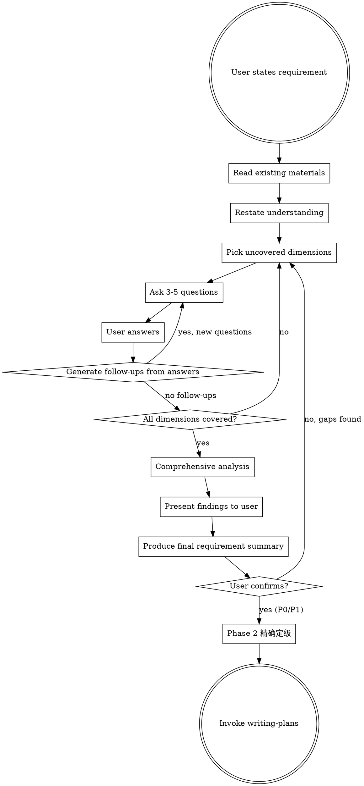

# Requirements Elicitation

## Overview

When user proposes a requirement, you MUST NOT jump to implementation. Instead, act as a senior business analyst: read existing materials, then systematically question across every affected dimension until both sides reach full consensus on what to build.

**Core principle:** Every unasked question is a future bug, rework, or misunderstanding. Ask now, save later.

## When to Use

- User proposes a new feature or requirement
- User describes a business need or change request
- User says "I want to...", "we need to...", "add a feature for..."
- User provides a PRD, spec, or requirement document to implement

**前置条件：** 本 skill 不再直接触发。所有变更类任务统一由 `ecw:risk-classifier` 作为入口，由 ecw:risk-classifier 根据风险等级和域数量决定是否 invoke 本 skill：
- P0/P1 单域需求 → ecw:risk-classifier invoke 本 skill（完整流程）
- P0/P1 跨域需求 → ecw:risk-classifier invoke `ecw:domain-collab`（替代本 skill）
- P2 → ecw:risk-classifier 跳过本 skill，直接进 writing-plans（1 轮简化确认）
- P3 → 跳过本 skill，直接实现

如果 ecw:risk-classifier 尚未执行，**先执行 ecw:risk-classifier**，再由其决定是否调用本 skill。

**When NOT to use:**
- User gives a precise, fully-specified technical task ("fix this null pointer on line 42")
- User explicitly says "just do it, no questions"
- **Bug 修复 / debugging 场景** — bug 修复仍需先经过 `ecw:risk-classifier` 进行风险预判，然后路由到 `superpowers:systematic-debugging` 进行定位和修复，不走本 skill
- ecw:risk-classifier 判定为 P2 或 P3 的变更

## Skill Interaction

**After user confirms the requirement summary,执行以下衔接步骤：**

1. **P0/P1 需求**：先执行 **ecw:risk-classifier Phase 2**（精确定级）。Phase 2 会基于本 skill 产出的需求摘要重新评估风险等级和影响范围，可能升降级并调整后续流程。Phase 2 完成后，再 invoke `superpowers:writing-plans`。
2. **P2 需求**（不应走到本 skill，但作为兜底）：直接 invoke `superpowers:writing-plans`。

**不要跳过 Phase 2 直接进入 writing-plans** — Phase 2 是需求分析完成到 plan 编写之间的必经节点。

## Core Flow



## Step-by-Step Process

### Step 1: Read Existing Materials

Before asking anything:
- Read relevant source code, configs, database schemas
- Read existing docs, PRDs, READMEs
- Understand current behavior and data model
- Note what already exists vs what's new

### Step 2: Restate Understanding

In 2-3 sentences, tell the user what you understood their requirement to be. This catches gross misunderstandings immediately.

### Step 3: Systematic Questioning

Ask questions in batches of **3-5 per round**. Each answer may trigger follow-up questions. Track which dimensions are covered using the checklist below.

**CRITICAL: Do NOT stop after one round.** Continue until ALL relevant dimensions have been explored. Each user answer opens new questions.

### Step 4: Comprehensive Analysis

After all Q&A rounds are complete, launch **one agent** using the Agent tool:

**Prompt:**
```
你是一位资深业务分析师，同时具备批判性审查能力。基于以下需求 Q&A，从两个视角进行分析：

## 视角 1：业务完整性
- 业务逻辑是否完整？缺失了哪些流程步骤？
- 状态转换是否清晰？有无未定义的状态跳转？
- 业务规则是否有漏洞？

## 视角 2：对抗审查
- 各回答之间是否存在矛盾？
- 有哪些未覆盖的边界场景？
- 哪些地方的规则可能互相冲突？
- 用户含糊带过了哪些复杂度？

请分开列出两个视角的发现，每条发现标注严重程度（致命/重要/建议）。
```

- Include: all Q&A context, existing code/doc findings

### Step 5: Present Findings & Produce Summary

Agent 返回后：
1. **致命/重要发现** → 直接向用户提出，作为补充问题或决策点
2. **建议类发现** → 纳入需求摘要的"注意事项"
3. **新问题** → 如果分析中发现了 Q&A 未覆盖的维度，追问用户

## Question Dimensions Checklist

You MUST consider EVERY dimension below. Skip only if genuinely irrelevant to this requirement.

### Business & Context
- What specific problem does this solve? Who requested it?
- What is the expected business outcome or metric improvement?
- Who are the end users? Are there different user roles involved?
- What is the priority and timeline?

### Process & Workflow
- How does the current workflow look? Draw it out step by step.
- What steps change? What new steps are added?
- Are there approval flows, review steps, or handoffs?
- What triggers this process? What ends it?
- Are there parallel paths or conditional branches?
- How does this interact with existing workflows?

### Data Model & State
- What new entities, fields, or tables are needed?
- What existing data is modified or reinterpreted?
- What are the valid states and state transitions?
- Are there calculated or derived fields?
- What are the data retention and archival rules?

### Business Rules & Validation
- What validation rules apply to each field?
- What calculation logic is involved?
- Are there business constraints (min/max, dependencies, exclusivity)?
- What formulas or algorithms drive the logic?
- Are there configurable rules vs hardcoded rules?

### Inventory, Resources & Quantities
- Does this affect stock, inventory, or resource levels?
- Are there reservation, hold, or allocation mechanics?
- What happens on quantity changes (increase, decrease, zero)?
- Are there unit conversions or multi-warehouse considerations?
- What about backorders, pre-orders, or negative stock?

### Edge Cases & Error Scenarios
- What happens when the operation fails midway?
- What if required data is missing or invalid?
- What if two users do the same thing simultaneously?
- What are the boundary conditions (zero, max, empty, overflow)?
- What if dependent systems are unavailable?
- What about timeout and retry behavior?

### Migration & Compatibility
- How to handle existing data?
- Is there a migration path or data backfill needed?
- What about backwards compatibility with existing features?
- Can this be rolled out gradually (feature flag, A/B)?

### Business Scenarios
- List all typical business scenarios involving this requirement
- How does each scenario differ in processing logic?
- Walk through each scenario step by step - are the rules the same?
- Are there seasonal, periodic, or conditional variations?
- What real-world examples can the user provide?

### Acceptance Criteria
- How do we verify this is working correctly?
- What are the specific test scenarios?
- What does "done" look like?

## Questioning Discipline

### Rules

1. **Ask in batches of 3-5** - Don't overwhelm with 20 questions at once
2. **Prioritize high-impact dimensions first** - Business rules before UI polish
3. **Follow-up on every answer** - Each answer likely reveals new questions
4. **Never assume** - If you're guessing, ask instead
5. **Reference existing code** - "I see the current `Order` model has X, does this change?"
6. **Be specific** - "What happens when inventory reaches zero during checkout?" not "What about edge cases?"
7. **Challenge vague answers** - "All users" -> "Including admin? Guest? API consumers?"

### Red Flags - You're Not Asking Enough

| Sign | Action |
|------|--------|
| You asked < 10 total questions | You almost certainly missed dimensions |
| No questions about edge cases | Go back and ask about failures, concurrency, boundaries |
| No questions about existing data | Ask about migration, backwards compatibility |
| User said "and so on" or "etc." | Unpack it - those hide complexity |
| You feel ready to implement after 1 round | You're not. Ask more. |
| No questions about what happens on error | Every happy path has an unhappy twin |

### When to Stop

Stop ONLY when:
- Every relevant dimension has at least one question asked and answered
- Follow-up questions from answers have been exhausted
- You can write a complete requirement summary without guessing
- The user confirms the summary is accurate

## Output: Requirement Summary

After comprehensive analysis and user decisions on findings, produce the final summary:

```markdown
## Requirement Summary: [Title]

### Problem Statement
[1-2 sentences on what problem this solves]

### Scope
- In scope: [bullet list]
- Out of scope: [bullet list]
- Assumptions: [bullet list]

### Detailed Requirements
[Organized by functional area, each with clear acceptance criteria]

### Data Changes
[New/modified entities, fields, states]

### Process Flow
[Step-by-step flow with decision points]

### Edge Cases & Error Handling
[Each scenario and expected behavior]

### Analysis Findings
- Critical/important findings incorporated above
- User decisions on open questions: [list each decision]

### Open Questions
[Anything still unresolved]
```

Wait for user confirmation. Once confirmed：
- **P0/P1**：先执行 ecw:risk-classifier Phase 2（精确定级），再 invoke `superpowers:writing-plans`
- **兜底**：如无 Phase 2 需要，直接 invoke `superpowers:writing-plans`

## Common Mistakes

| Mistake | Fix |
|---------|-----|
| Jumping to implementation after hearing the requirement | STOP. Read code first, then ask questions |
| Asking only about the happy path | Explicitly ask about failures, edges, concurrency |
| Accepting "same as X" without verifying | Read X, then confirm specifics differ or match |
| Stopping after one round of questions | Each answer generates new questions. Keep going. |
| Asking too many questions at once | Batch to 3-5, prioritize by impact |
| Not reading existing code first | You miss half the relevant questions without context |
