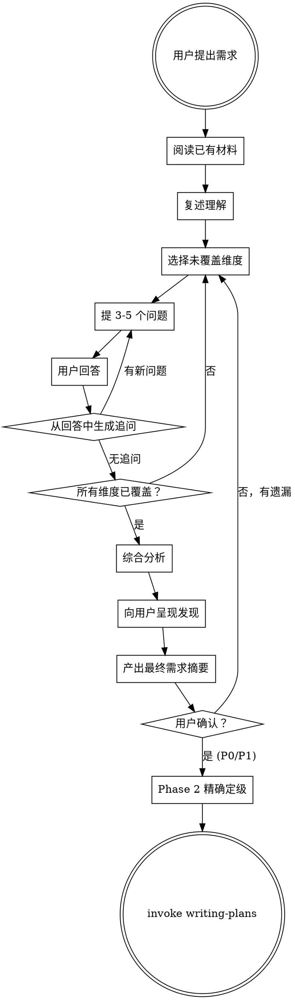

# 需求澄清

## 概述

当用户提出需求时，**不得**直接跳到实现。而是作为资深业务分析师：先阅读已有材料，然后系统性地逐维度提问，直到双方对要构建的内容达成完全共识。

**核心原则：** 每一个没问到的问题，都是未来的 bug、返工或误解。现在多问，将来少改。

## 何时使用

- 用户提出新功能或需求
- 用户描述业务需要或变更请求
- 用户说"我想要……"、"我们需要……"、"增加一个功能……"
- 用户提供 PRD、规格说明或需求文档要求实现

**前置条件：** 本 skill 不再直接触发。所有变更类任务统一由 `ecw:risk-classifier` 作为入口，由 ecw:risk-classifier 根据风险等级和域数量决定是否 invoke 本 skill：
- P0/P1 单域需求 → ecw:risk-classifier invoke 本 skill（完整流程）
- P0/P1 跨域需求 → ecw:risk-classifier invoke `ecw:domain-collab`（替代本 skill）
- P2 → ecw:risk-classifier 跳过本 skill，直接进 writing-plans（1 轮简化确认）
- P3 → 跳过本 skill，直接实现

如果 ecw:risk-classifier 尚未执行，**先执行 ecw:risk-classifier**，再由其决定是否调用本 skill。

**不适用场景：**
- 用户给出精确且完全指定的技术任务（"修复第 42 行的空指针"）
- 用户明确表示"直接做，不要问了"
- **Bug 修复 / debugging 场景** — bug 修复仍需先经过 `ecw:risk-classifier` 进行风险预判，然后路由到 `superpowers:systematic-debugging` 进行定位和修复，不走本 skill
- ecw:risk-classifier 判定为 P2 或 P3 的变更

## Skill 衔接

**用户确认需求摘要后，执行以下衔接步骤：**

1. **P0/P1 需求**：先执行 **ecw:risk-classifier Phase 2**（精确定级）。Phase 2 会基于本 skill 产出的需求摘要重新评估风险等级和影响范围，可能升降级并调整后续流程。Phase 2 完成后，再 invoke `superpowers:writing-plans`。
2. **P2 需求**（不应走到本 skill，但作为兜底）：直接 invoke `superpowers:writing-plans`。

**不要跳过 Phase 2 直接进入 writing-plans** — Phase 2 是需求分析完成到 plan 编写之间的必经节点。

## 核心流程



## 分步流程

### 步骤 1：阅读已有材料

在提问之前：
- 阅读相关源代码、配置、数据库 schema
- 阅读已有文档、PRD、README
- 理解当前行为和数据模型
- 记录哪些已存在、哪些是新增

### 步骤 2：复述理解

用 2-3 句话告诉用户你对其需求的理解。这能立即发现重大误解。

### 步骤 3：系统性提问

每轮提 **3-5 个问题**。每个回答可能触发追问。使用下方的检查清单跟踪哪些维度已覆盖。

**关键：不要在一轮后就停止。** 继续提问直到所有相关维度都已探索。每个用户回答都会打开新的问题。

### 步骤 4：综合分析

所有 Q&A 轮次完成后，使用 Agent 工具启动**一个 agent**：

**Prompt：**
```
你是一位资深业务分析师，同时具备批判性审查能力。基于以下需求 Q&A，从两个视角进行分析：

## 视角 1：业务完整性
- 业务逻辑是否完整？缺失了哪些流程步骤？
- 状态转换是否清晰？有无未定义的状态跳转？
- 业务规则是否有漏洞？

## 视角 2：对抗审查
- 各回答之间是否存在矛盾？
- 有哪些未覆盖的边界场景？
- 哪些地方的规则可能互相冲突？
- 用户含糊带过了哪些复杂度？

请分开列出两个视角的发现，每条发现标注严重程度（致命/重要/建议）。
```

- 包含：所有 Q&A 上下文、已有代码/文档发现

### 步骤 5：呈现发现并产出摘要

Agent 返回后：
1. **致命/重要发现** → 直接向用户提出，作为补充问题或决策点
2. **建议类发现** → 纳入需求摘要的"注意事项"
3. **新问题** → 如果分析中发现了 Q&A 未覆盖的维度，追问用户

## 提问维度检查清单

你**必须**考虑以下每一个维度。仅在确实与当前需求无关时才跳过。

### 业务与背景
- 这具体解决什么问题？谁提出的？
- 预期的业务成果或指标改善是什么？
- 最终用户是谁？是否涉及不同的用户角色？
- 优先级和时间线？

### 流程与工作流
- 当前工作流是什么样的？逐步画出来。
- 哪些步骤有变化？增加了哪些新步骤？
- 是否有审批流、审核步骤或交接环节？
- 什么触发这个流程？什么结束它？
- 是否有并行路径或条件分支？
- 这与现有工作流如何交互？

### 数据模型与状态
- 需要哪些新实体、字段或表？
- 哪些已有数据被修改或重新解读？
- 有效的状态和状态转换是什么？
- 是否有计算字段或派生字段？
- 数据保留和归档规则？

### 业务规则与校验
- 每个字段适用什么校验规则？
- 涉及什么计算逻辑？
- 是否有业务约束（最小/最大值、依赖关系、互斥性）？
- 哪些公式或算法驱动逻辑？
- 哪些规则可配置、哪些硬编码？

### 库存、资源与数量
- 是否影响库存、存货或资源水平？
- 是否有预留、锁定或分配机制？
- 数量变化时（增加、减少、归零）怎么处理？
- 是否有单位换算或多仓考虑？
- 缺货订单、预售或负库存怎么办？

### 边界场景与异常处理
- 操作中途失败怎么办？
- 如果必需数据缺失或无效？
- 如果两个用户同时做同一件事？
- 边界条件是什么（零、最大值、空、溢出）？
- 依赖系统不可用怎么办？
- 超时和重试行为？

### 迁移与兼容性
- 已有数据如何处理？
- 是否需要迁移路径或数据回填？
- 与已有功能的向后兼容性？
- 能否分阶段上线（功能开关、A/B 测试）？

### 业务场景
- 列出涉及本需求的所有典型业务场景
- 各场景在处理逻辑上有何不同？
- 逐步走查每个场景 — 规则是否相同？
- 是否有季节性、周期性或条件性变化？
- 用户能提供哪些真实案例？

### 验收标准
- 如何验证功能正常工作？
- 具体的测试场景有哪些？
- "完成"是什么样的？

## 提问纪律

### 规则

1. **每轮 3-5 个问题** — 不要一次扔 20 个问题
2. **优先提问高影响维度** — 业务规则优先于 UI 细节
3. **对每个回答追问** — 每个回答很可能引出新问题
4. **绝不假设** — 如果在猜测，就去问
5. **引用已有代码** — "我看到当前 `Order` 模型有 X，这会改变吗？"
6. **问题要具体** — "结算时库存归零会怎样？"而不是"边界情况怎么办？"
7. **质疑模糊回答** — "所有用户" → "包括管理员？访客？API 调用方？"

### 危险信号 — 你问得还不够

| 信号 | 行动 |
|------|------|
| 总共问了不到 10 个问题 | 几乎可以肯定遗漏了维度 |
| 没有关于边界情况的问题 | 回去问失败、并发、边界相关问题 |
| 没有关于已有数据的问题 | 问迁移和向后兼容性 |
| 用户说了"等等"或"之类的" | 追问展开 — 那里面藏着复杂度 |
| 一轮后就觉得可以开始实现了 | 不行。继续问。 |
| 没有关于出错时怎么办的问题 | 每条正常路径都有一条异常路径 |

### 何时停止

仅在以下条件全部满足时停止：
- 每个相关维度都至少有一个问题被提出和回答
- 回答引出的追问已全部穷尽
- 你能写出完整的需求摘要而不需要猜测
- 用户确认摘要准确

## 输出：需求摘要

综合分析完成、用户对发现做出决策后，产出最终摘要：

```markdown
## 需求摘要：[标题]

### 问题陈述
[1-2 句话说明解决什么问题]

### 范围
- 范围内：[列表]
- 范围外：[列表]
- 假设：[列表]

### 详细需求
[按功能区域组织，每项附明确的验收标准]

### 数据变更
[新增/修改的实体、字段、状态]

### 流程
[带决策点的逐步流程]

### 边界场景与异常处理
[每个场景及预期行为]

### 分析发现
- 致命/重要发现已整合到上方对应章节
- 用户对开放问题的决策：[逐条列出]

### 待定问题
[仍未解决的问题]
```

等待用户确认。确认后：
- **P0/P1**：先执行 ecw:risk-classifier Phase 2（精确定级），再 invoke `superpowers:writing-plans`
- **兜底**：如无 Phase 2 需要，直接 invoke `superpowers:writing-plans`

## 常见错误

| 错误 | 纠正 |
|------|------|
| 听到需求就直接跳到实现 | 停。先读代码，再提问 |
| 只问正常路径 | 必须明确问失败、边界、并发场景 |
| 接受"和 X 一样"而不验证 | 读 X 的实际内容，再确认异同 |
| 一轮提问后就停止 | 每个回答都会生成新问题。继续。 |
| 一次问太多问题 | 每轮 3-5 个，按影响优先排序 |
| 不先读已有代码 | 不了解上下文，你会漏掉一半的关键问题 |
