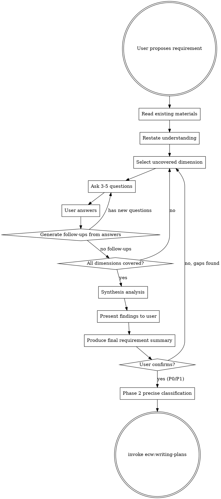

# Requirements Elicitation

## Overview

When user proposes a requirement, **do NOT** jump straight to implementation. Instead, act as a senior business analyst: read existing materials first, then systematically ask questions dimension by dimension until both sides reach full consensus on what to build.

**Output language**: Read `ecw.yml` → `project.output_language`. All artifact headings, table headers, and labels in `requirements-summary.md` follow this language.

**Core Principle:** Every question you don't ask now becomes a future bug, rework, or misunderstanding. Ask more now, change less later.

**Announce at start:** "Using ecw:requirements-elicitation for systematic requirement analysis."

**Mode switch**: Update session-state.md MODE marker to `analysis` (if session-state.md exists).

## When to Use

- User proposes a new feature or requirement
- User describes a business need or change request
- User says "I want to...", "We need to...", "Add a feature..."
- User provides a PRD, specification, or requirement document for implementation

**Invocation modes:**
- **Standalone**: `/ecw:requirements-elicitation` — execute full 9-dimension questioning directly. No risk-classifier prerequisite needed.
- **Auto-routed**: `ecw:risk-classifier` invokes this skill for P0/P1 single-domain requirements (risk level and domain info available via session-state.md).

**When NOT to use:**
- User gives a precise, fully-specified technical task ("fix the null pointer on line 42")
- User explicitly says "just do it, don't ask questions"
- **Bug fix / debugging scenarios** — route to `ecw:systematic-debugging` instead

## Skill Handoff

**After user confirms the requirement summary, execute the following handoff steps:**

1. **If session-state.md exists (workflow mode)**: Execute **ecw:risk-classifier Phase 2** (precise classification), then invoke `ecw:writing-plans`.
2. **If session-state.md absent (standalone mode)**: Directly invoke `ecw:writing-plans` with the requirement summary. writing-plans will default to P0 full detail mode.

## Core Flow



## Step-by-Step Process

### Step 1: Read Existing Materials

Before asking questions:
- Read relevant source code, configuration, database schema
- Read existing documentation, PRDs, READMEs
- Understand current behavior and data model
- Note what already exists vs. what is new

### Step 2: Restate Understanding

Tell the user your understanding of their requirement in 2-3 sentences. This immediately catches major misunderstandings.

### Step 3: Systematic Questioning

Ask **3-5 questions** per round. Each answer may trigger follow-ups. Read `./prompts/questioning-guide.md` for the full 9-dimension checklist and questioning discipline (rules, red flags, termination limits).

**Key: Do not stop after one round.** Continue asking until all relevant dimensions have been explored. Every user answer opens new questions.

**Per-round checkpoint**: After each Q&A round completes (user answers all questions), append the round summary to `.claude/ecw/session-data/{workflow-id}/requirements-summary.md`:
```markdown
### Round {N} — {covered dimensions}
**Questions**: {list of questions asked}
**Answers**: {summary of user answers}
**Follow-ups identified**: {list, or "none"}
**Dimensions remaining**: {uncovered dimensions}
```
This incremental append ensures Q&A history survives context compaction during long elicitation sessions.

### Step 4: Synthesis Analysis

After all Q&A rounds complete, use the Agent tool to launch **one agent**. Read `./prompts/synthesis-prompt.md` for the full prompt template and return value validation rules.

**Ledger update**: After Agent returns, append one row to `.claude/ecw/session-data/{workflow-id}/session-state.md` Subagent Ledger table: `| requirements-elicitation | synthesis-analysis | general | sonnet | medium | {HH:mm} | {duration} |`. Note time before dispatch and compute duration after return.

**Timeout**: 180s. If synthesis Agent has not returned, terminate and present Q&A findings directly to user (see Error Handling).

### Step 5: Present Findings and Produce Summary

After Agent returns:
1. **Critical/important findings** → Present directly to user as supplementary questions or decision points
2. **Suggestion findings** → Include in the "Notes" section of requirement summary
3. **New questions** → If analysis discovered dimensions not covered in Q&A, ask user

## Output: Requirement Summary

After synthesis analysis completes and user has made decisions on findings, produce the final summary:

```markdown
## Requirement Summary: [Title]

### Problem Statement
[1-2 sentences on what problem this solves]

### Scope
- In scope: [list]
- Out of scope: [list]
- Assumptions: [list]

### Detailed Requirements
[Organized by functional area, each item with clear acceptance criteria]

### Data Changes
[New/modified entities, fields, states]

### Workflow
[Step-by-step process with decision points]

### Edge Cases & Error Handling
[Each scenario with expected behavior]

### Analysis Findings
- Critical/important findings integrated into corresponding sections above
- User decisions on open questions: [list each]

### Open Questions
[Questions still unresolved]
```

**Checkpoint**: After producing the requirement summary above, write it to `.claude/ecw/session-data/{workflow-id}/requirements-summary.md` using the Write tool. This ensures the summary survives context compaction and is available for downstream skills (Phase 2, writing-plans) without depending on conversation history.

Wait for user confirmation. After confirmation:
- **P0/P1**: First execute ecw:risk-classifier Phase 2 (precise classification), then invoke `ecw:writing-plans`
- **Fallback**: If Phase 2 not needed, invoke `ecw:writing-plans` directly

> **CRITICAL — Auto-Continue Rule**: After user confirms the requirement summary, update session-state.md `Next` field, then **immediately invoke** the next skill:
> - **P0/P1**: Immediately invoke risk-classifier Phase 2. After Phase 2 completes, immediately invoke `ecw:writing-plans`. Do NOT output confirmation text between these transitions.
> - **P2**: Immediately invoke `ecw:writing-plans`.
> - The user's confirmation of the requirement summary IS the go-ahead for the rest of the workflow. If `Auto-Continue` field is missing or `no` in session-state.md, fall back to waiting for user direction (backward compatibility).

## Error Handling

| Scenario | Handling |
|----------|---------|
| Synthesis analysis Agent returns empty or fails | Record `FAILED` in Subagent Ledger → retry once → still fails: skip synthesis, present Q&A findings directly to user with `[Warning: automated synthesis unavailable, manual review recommended]` |
| `requirements-summary.md` write failure | Retry once → still fails: output full requirement summary in conversation (ensures downstream skills can still reference it) |

## Supplementary Files

| File | Purpose |
|------|---------|
| `./prompts/questioning-guide.md` | 9-dimension checklist + questioning discipline (rules, red flags, when to stop, termination limits) |
| `./prompts/synthesis-prompt.md` | Synthesis analysis Agent prompt template + return value validation rules |
| `./prompts/common-mistakes.md` | Common anti-patterns to avoid during elicitation |

Read `./prompts/common-mistakes.md` before beginning elicitation as a self-check reminder.
