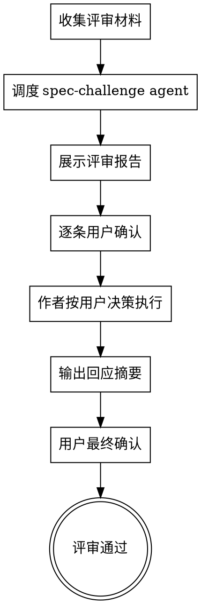

# Spec Challenge — 方案对抗评审

在方案/设计文档产出后，调度 `spec-challenge` agent 进行独立的对抗性评审，评审报告展示给用户后由用户逐条确认处理方式。

## 触发方式

- **手动**：`/spec-challenge <文件路径>` — 对指定文档发起评审
- **手动（无参数）**：`/spec-challenge` — 自动查找当前会话中最近产出的 spec 文件
- **自动**：P0 变更、P1 跨域变更的 writing-plans 完成后，自动触发

## 流程



### 关键规则：用户主导决策

**spec-challenge 报告返回后，严禁 AI 自行回应。** 必须按以下步骤执行：

1. **展示** — 完整展示 spec-challenge 的评审报告原文
2. **逐条确认** — 对每条致命缺陷（F1, F2, ...），用 AskUserQuestion 让用户选择处理方式：
   - ✅ 同意修改 — AI 按此执行修改
   - ❌ 不同意 — 用户提供理由或由 AI 草拟技术反驳供用户确认
   - ❓ 需要讨论 — 进入讨论，直到用户做出决定
3. **改进建议批量确认** — 改进建议（I1, I2, ...）可以一次性展示，让用户多选采纳/延后
4. **执行** — AI 根据用户确认的决策逐条执行
5. **最终确认** — 输出回应摘要，用户确认后评审通过

对盲区标注：确认是否需要在文档中明确标注。

## 调度 Agent 的 Prompt 模板

调度 spec-challenge agent 时，Coordinator 先确定 `{affected_domains}`：
- **自动触发**：从当前会话中 domain-collab 报告或 risk-classifier 输出获取域列表
- **手动触发**：从文档内容中提取涉及的域关键词，匹配项目 CLAUDE.md 域路由表；如无法确定，设为"请从文档内容推断涉及的域"

使用以下 prompt 结构：

```
请评审一份技术方案文档。

## 待评审文档位置

文件路径：{文档文件路径}

请自行读取该文件获取完整内容。

## 项目背景

读取 `.claude/ecw/ecw.yml` 获取 project.name，读取 ecw.yml `paths.domain_registry` 获取域列表。
项目知识文档位于 ecw.yml `paths.knowledge_root` 指定的目录。
跨域调用关系记录在 ecw.yml `paths.knowledge_common` 下的 `cross-domain-rules.md`。

方案涉及的域：{affected_domains}
按需读取上述域的相关知识文件验证方案的准确性。不要一次性读取所有知识文件。

## 评审要求

按你的评审维度（准确性、信息质量、边界与盲区、健壮性）逐一评审。
严格按规定的输出格式返回评审报告。

请使用中文输出评审报告。
```

## 用户确认流程详细说明

### 步骤 1：展示评审报告

spec-challenge agent 返回后，**原样展示**完整评审报告给用户。不做任何回应、不做任何判断。

### 步骤 2：逐条致命缺陷确认

对每条致命缺陷（F1, F2, ...），用 AskUserQuestion 向用户提问：

```
问题: "[F{n}] {缺陷标题} — {缺陷摘要}，你的决定？"
选项:
  - "同意修改" — AI 将修改方案文档来解决此缺陷
  - "不同意" — 保持原方案，AI 草拟技术反驳理由供你确认
  - "需要讨论" — 进入讨论，你可以补充上下文后再决定
```

**可以将多个致命缺陷合并到一次 AskUserQuestion 中（每条一个问题，最多 4 条一组）。**

### 步骤 3：改进建议批量确认

改进建议（I1, I2, ...）列表展示后，用一个多选 AskUserQuestion 让用户选择采纳项：

```
问题: "以下改进建议，哪些需要采纳？未选的将延后到后续迭代。"
multiSelect: true
选项: I1, I2, I3, ...
```

### 步骤 4：按用户决策执行

根据用户的选择：
- **同意修改的致命缺陷** → 修改方案文档，说明具体改动
- **不同意的致命缺陷** → 草拟技术反驳理由，展示给用户确认
- **采纳的改进建议** → 更新文档
- **延后的改进建议** → 记录到文档"后续迭代"章节

## 回应摘要格式

所有条目处理完毕后，输出汇总表供用户最终确认：

```markdown
## 评审回应摘要

| 编号 | 类型 | 标题 | 用户决策 | 执行结果 |
|------|------|------|---------|---------|
| F1 | 致命 | ... | ✅ 同意修改 | 已更新 §3.2 |
| F2 | 致命 | ... | ❌ 不同意 | 技术反驳：... |
| F3 | 致命 | ... | ❓ 讨论后同意 | 已更新 §4.1 |
| I1 | 改进 | ... | ✅ 采纳 | 已更新 |
| I2 | 改进 | ... | ⏭️ 延后 | 记录到后续迭代 |

**状态**：等待用户最终确认
```

输出摘要后，用 AskUserQuestion 请求用户最终确认：
- "确认通过" — 评审完成，进入下一阶段
- "还有修改" — 用户补充意见，继续调整

## 评审完成条件

- **用户已逐条确认**所有致命缺陷的处理方式
- 所有致命缺陷要么被修复（用户同意），要么被技术理由反驳（用户不同意）
- 用户已选择采纳/延后的改进建议
- 文档已更新反映所有"同意修改"和"采纳"的改动
- **用户最终确认**回应摘要，评审通过

## 与流程的集成

### 自动触发场景

writing-plans 完成后，以下场景自动触发 ecw:spec-challenge 对抗审查：

- **P0 变更**（任何域模式）
- **P1 跨域变更**（涉及 2+ 域的高风险变更，跨域耦合风险需要独立审查）

流程：

1. writing-plans 输出 plan 文件
2. **先触发 ecw:spec-challenge** — 对 plan 进行对抗性评审
3. challenge-response 完成后，将更新后的 plan 交给用户 review
4. 用户 review 通过后进入实现

```
ecw:risk-classifier (P0 / P1跨域)
  → ecw:requirements-elicitation / ecw:domain-collab
  → Phase 2
  → writing-plans: write plan
  → ecw:spec-challenge (adversarial review + author response)
  → user review (with challenge results visible)
  → implementation
```

### 手动触发

任何时候对任意 spec/plan 文件执行 `/spec-challenge <文件路径>`。
