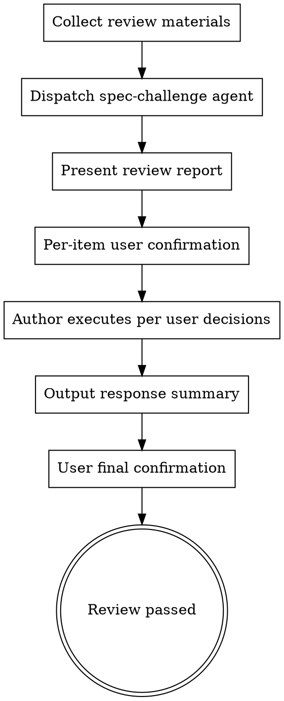

# Spec Challenge — Adversarial Plan Review

After a plan/design document is produced, dispatch the `spec-challenge` agent for independent adversarial review. Present the review report to the user, who confirms handling for each item.

**Announce at start:** "Using ecw:spec-challenge for adversarial plan review."

**Output language**: Read `ecw.yml` → `project.output_language`. Pass to dispatched agent prompt. Report headings and labels follow this language.

## Trigger

- **Manual**: `/spec-challenge <file path>` — Launch review on specified document
- **Manual (no args)**: `/spec-challenge` — Auto-find the most recently produced spec file in current session
- **Automatic**: After ecw:writing-plans completes for P0 changes or P1 cross-domain changes

**Auto-trigger flow**:

```
ecw:risk-classifier (P0 / P1 cross-domain)
  → ecw:requirements-elicitation / ecw:domain-collab
  → Phase 2
  → ecw:writing-plans: write plan
  → ecw:spec-challenge (adversarial review + author response)
  → user review (with challenge results visible)
  → implementation
```

## Flow



### Key Rule: User Drives Decisions

**After spec-challenge report returns, AI must NOT respond on its own.** Follow these steps strictly:

1. **Present** — Display the full spec-challenge review report verbatim
2. **Per-item confirmation** — For each fatal flaw (F1, F2, ...), use AskUserQuestion to let user choose handling:
   - ✅ Agree to modify — AI executes the modification
   - ❌ Disagree — User provides rationale, or AI drafts technical rebuttal for user confirmation
   - ❓ Needs discussion — Enter discussion until user decides
3. **Batch confirm improvements** — Improvement suggestions (I1, I2, ...) can be presented at once, letting user multi-select which to adopt/defer
4. **Execute** — AI executes per user-confirmed decisions
5. **Final confirmation** — Output response summary, review passes after user confirms

For blind spot annotations: Confirm whether they need to be explicitly noted in the document.

## Agent Dispatch

Read `./prompts/review-prompt-template.md` for the complete agent dispatch prompt template, model selection, and timeout configuration.

## User Confirmation Flow Details

### Step 1: Present Review Report

After spec-challenge agent returns:

1. **Return value validation**: Verify the report contains the required structure (## Fatal Flaws, ## Improvement Suggestions, ## Conclusion). If the report is missing critical sections:
   - Log to Ledger: `[FAILED: spec-challenge, reason: malformed report]`
   - Retry once with the same model
   - If retry also fails: output the partial report as-is with `[degraded: incomplete review]` header, proceed with whatever findings are available
2. **Persist report**: Write the full review report to `.claude/ecw/session-data/{workflow-id}/spec-challenge-report.md`. This MUST happen **before** any Plan modifications — the report is an independent artifact that records the original findings regardless of how the author responds.
3. **Present verbatim** the full review report to user. No responses, no judgments.

### Step 2: Per-Item Fatal Flaw Confirmation

For each fatal flaw (F1, F2, ...), use AskUserQuestion to ask the user:

```
Question: "[F{n}] {flaw title} — {flaw summary}. Your decision?"
Options:
  - "Agree to modify" — AI will modify the plan document to address this flaw
  - "Disagree" — Keep original plan; AI will draft technical rebuttal for your confirmation
  - "Needs discussion" — Enter discussion; you can provide additional context before deciding
```

**"Needs discussion" termination**: If user selects "Needs discussion" for the same flaw 3 times without reaching a decision, force closure: present the two options (agree/disagree) without the discussion option. Output `[Discussion limit reached for F{n}, forcing decision]`.

**Multiple fatal flaws can be combined into one AskUserQuestion (one question per flaw, max 4 per group).**

### Step 3: Batch Confirm Improvement Suggestions

After presenting the improvement suggestions (I1, I2, ...) list, use one multi-select AskUserQuestion for user to select which to adopt:

```
Question: "Which improvement suggestions should be adopted? Unselected ones will be deferred to future iterations."
multiSelect: true
Options: I1, I2, I3, ...
```

### Step 4: Execute Per User Decisions

Based on user selections:
- **Agreed fatal flaws** → Modify plan document, describe specific changes
- **Disagreed fatal flaws** → Draft technical rebuttal, present to user for confirmation
- **Adopted improvements** → Update document
- **Deferred improvements** → Record in document's "Future Iterations" section

**Plan Revision Strategy (CRITICAL)**:

The coordinator (main session) directly revises the plan document — do not dispatch a subagent for plan revision. Both the Plan content and the review findings are already in the coordinator's context, so delegating adds latency with no benefit.

Use Write to overwrite the entire plan file rather than incremental edits. Plan files are typically 50-80KB; do not use Edit for large plan files as exact-match replacement is fragile and error-prone on files of this size.

Exception: If the plan requires >30% content restructuring AND exceeds 100KB, a subagent may be dispatched, but it must also use Write (full overwrite), not Edit.

## Response Summary Format

After all items are handled, output summary table for user final confirmation:

```markdown
## Review Response Summary

| ID | Type | Title | User Decision | Execution Result |
|----|------|-------|--------------|-----------------|
| F1 | Fatal | ... | ✅ Agree to modify | Updated §3.2 |
| F2 | Fatal | ... | ❌ Disagree | Technical rebuttal: ... |
| F3 | Fatal | ... | ❓ Discussed, then agreed | Updated §4.1 |
| I1 | Improvement | ... | ✅ Adopted | Updated |
| I2 | Improvement | ... | ⏭️ Deferred | Recorded for future iterations |

**Status**: Awaiting user final confirmation
```

**User Decisions Persistence (Phase 3 Calibration)**: When generating the Response Summary, append a `## User Decisions` table to `spec-challenge-report.md`. This table records accepted/rejected/deferred decisions for Phase 3 multi-skill calibration. Write once, batch — do not append per-item during the confirmation flow.

Format to append to `spec-challenge-report.md`:

```markdown
## User Decisions

| Finding | Decision | Rationale |
|---------|----------|-----------|
| F1 | accepted | — |
| F2 | rejected | user rationale |
| I1 | accepted | — |
| I2 | deferred | — |
```

Use `accepted` / `rejected` / `deferred` (lowercase English) as the standard Decision values for machine-parseable Phase 3 calibration. Map from user selections:
- "Agree to modify" / "Adopted" → `accepted`
- "Disagree" → `rejected`
- "Deferred" → `deferred`

After outputting summary, use AskUserQuestion for user final confirmation:
- "Confirm passed" — Review complete, proceed to next phase
- "More changes needed" — User adds feedback, continue adjusting

## Review Completion Conditions

- User has **confirmed handling** for every fatal flaw
- All fatal flaws are either fixed (user agreed) or rebutted with technical rationale (user disagreed)
- User has selected which improvement suggestions to adopt/defer
- Document has been updated to reflect all "agree to modify" and "adopted" changes
- **User final confirmation** on response summary — review passed

## Post-Review: Auto-Continue to Implementation

After spec-challenge completes and user confirms review results (Plan updated), immediately invoke the next skill. Read `next` from `.claude/ecw/session-data/{workflow-id}/session-state.json` and call it directly — do not ask for confirmation, do not output a transition message. The user already approved the full routing chain during Phase 1. All analysis artifacts are already persisted to `session-data/`.

## Error Handling

| Scenario | Handling |
|----------|---------|
| Spec-challenge Agent returns empty or fails | Record `FAILED` in Subagent Ledger → retry once → still fails: notify user `[DEGRADED: adversarial review unavailable]` and ask whether to proceed without review or retry manually |
| Spec-challenge Agent timeout (300s exceeded) | Record `TIMEOUT` in Subagent Ledger → **retry subagent once** (source code reading limits already enforced) → still times out: notify user and offer retry manually or proceed without review |
| Agent returns unstructured text (no F/I items) | Treat entire response as a single improvement suggestion (I1) and present to user for confirmation |
| `spec-challenge-report.md` write failure | Retry once → still fails: output full report in conversation and continue with user confirmation flow |

## Common Rationalizations

Read `./prompts/common-rationalizations.md` for anti-patterns to avoid.

## Supplementary Files

- `prompts/review-prompt-template.md` — Agent dispatch prompt template, model selection, timeout
- `prompts/common-rationalizations.md` — Common anti-patterns to avoid
