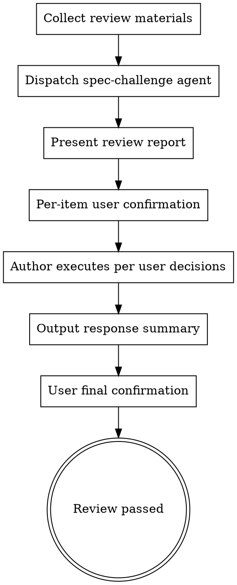

# Spec Challenge — Adversarial Plan Review

After a plan/design document is produced, dispatch the `spec-challenge` agent for independent adversarial review. Present the review report to the user, who confirms handling for each item.

## Trigger

- **Manual**: `/spec-challenge <file path>` — Launch review on specified document
- **Manual (no args)**: `/spec-challenge` — Auto-find the most recently produced spec file in current session
- **Automatic**: After ecw:writing-plans completes for P0 changes or P1 cross-domain changes

## Flow



### Key Rule: User Drives Decisions

**After spec-challenge report returns, AI must NOT respond on its own.** Follow these steps strictly:

1. **Present** — Display the full spec-challenge review report verbatim
2. **Per-item confirmation** — For each fatal flaw (F1, F2, ...), use AskUserQuestion to let user choose handling:
   - ✅ Agree to modify — AI executes the modification
   - ❌ Disagree — User provides rationale, or AI drafts technical rebuttal for user confirmation
   - ❓ Needs discussion — Enter discussion until user decides
3. **Batch confirm improvements** — Improvement suggestions (I1, I2, ...) can be presented at once, letting user multi-select which to adopt/defer
4. **Execute** — AI executes per user-confirmed decisions
5. **Final confirmation** — Output response summary, review passes after user confirms

For blind spot annotations: Confirm whether they need to be explicitly noted in the document.

## Agent Dispatch Prompt Template

When dispatching the spec-challenge agent, Coordinator first determines `{affected_domains}`:
- **Auto-trigger**: Get domain list from current session's domain-collab report or risk-classifier output
- **Manual trigger**: Extract domain keywords from document content, match against project CLAUDE.md domain routing table; if undeterminable, set to "please infer involved domains from document content"

**Model selection**: `model: sonnet` (adversarial review requires critical thinking and deep understanding of plan logic, but does not need Opus-level creativity).

Use the following prompt structure:

```
Please review a technical plan document.

## Document to Review

File path: {document file path}

Please read the file yourself to get the full content.

## Project Context

Read `.claude/ecw/ecw.yml` to get project.name, read ecw.yml `paths.domain_registry` to get domain list.
Project knowledge documents are in the directory specified by ecw.yml `paths.knowledge_root`.
Cross-domain call relationships are recorded in `cross-domain-rules.md` under ecw.yml `paths.knowledge_common`.

Domains involved in the plan: {affected_domains}
Read relevant knowledge files for the above domains as needed to verify plan accuracy. Do not read all knowledge files at once.

## Review Requirements

Review each dimension (accuracy, information quality, boundaries & blind spots, robustness) one by one.
Strictly follow the prescribed output format for the review report.

Please output the review report in Chinese.
```

## User Confirmation Flow Details

### Step 1: Present Review Report

After spec-challenge agent returns:

1. **Return value validation**: Verify the report contains the required structure (## Fatal Flaws, ## Improvement Suggestions, ## Conclusion). If the report is missing critical sections:
   - Log to Ledger: `[FAILED: spec-challenge, reason: malformed report]`
   - Retry once with the same model
   - If retry also fails: output the partial report as-is with `[degraded: incomplete review]` header, proceed with whatever findings are available
2. **Ledger update**: Append one row to `.claude/ecw/session-state.md` Subagent Ledger table: `| spec-challenge | reviewer | ecw:spec-challenge | large |`. Scale reference: small (<20K tokens), medium (20-80K), large (>80K); spec-challenge agent is typically large.
2. Write the full review report to `.claude/ecw/spec-challenge-report.md`.
3. **Present verbatim** the full review report to user. No responses, no judgments.

### Step 2: Per-Item Fatal Flaw Confirmation

For each fatal flaw (F1, F2, ...), use AskUserQuestion to ask the user:

```
Question: "[F{n}] {flaw title} — {flaw summary}. Your decision?"
Options:
  - "Agree to modify" — AI will modify the plan document to address this flaw
  - "Disagree" — Keep original plan; AI will draft technical rebuttal for your confirmation
  - "Needs discussion" — Enter discussion; you can provide additional context before deciding
```

**Multiple fatal flaws can be combined into one AskUserQuestion (one question per flaw, max 4 per group).**

### Step 3: Batch Confirm Improvement Suggestions

After presenting the improvement suggestions (I1, I2, ...) list, use one multi-select AskUserQuestion for user to select which to adopt:

```
Question: "Which improvement suggestions should be adopted? Unselected ones will be deferred to future iterations."
multiSelect: true
Options: I1, I2, I3, ...
```

### Step 4: Execute Per User Decisions

Based on user selections:
- **Agreed fatal flaws** → Modify plan document, describe specific changes
- **Disagreed fatal flaws** → Draft technical rebuttal, present to user for confirmation
- **Adopted improvements** → Update document
- **Deferred improvements** → Record in document's "Future Iterations" section

## Response Summary Format

After all items are handled, output summary table for user final confirmation:

```markdown
## Review Response Summary

| ID | Type | Title | User Decision | Execution Result |
|----|------|-------|--------------|-----------------|
| F1 | Fatal | ... | ✅ Agree to modify | Updated §3.2 |
| F2 | Fatal | ... | ❌ Disagree | Technical rebuttal: ... |
| F3 | Fatal | ... | ❓ Discussed, then agreed | Updated §4.1 |
| I1 | Improvement | ... | ✅ Adopted | Updated |
| I2 | Improvement | ... | ⏭️ Deferred | Recorded for future iterations |

**Status**: Awaiting user final confirmation
```

After outputting summary, use AskUserQuestion for user final confirmation:
- "Confirm passed" — Review complete, proceed to next phase
- "More changes needed" — User adds feedback, continue adjusting

## Review Completion Conditions

- User has **confirmed handling** for every fatal flaw
- All fatal flaws are either fixed (user agreed) or rebutted with technical rationale (user disagreed)
- User has selected which improvement suggestions to adopt/defer
- Document has been updated to reflect all "agree to modify" and "adopted" changes
- **User final confirmation** on response summary — review passed

## Workflow Integration

### Auto-Trigger Scenarios

After ecw:writing-plans completes, ecw:spec-challenge adversarial review auto-triggers for:

- **P0 changes** (any domain mode)
- **P1 cross-domain changes** (high-risk changes involving 2+ domains — cross-domain coupling risks need independent review)

Flow:

1. ecw:writing-plans outputs plan file
2. **Trigger ecw:spec-challenge first** — Adversarial review of the plan
3. After challenge-response completes, present updated plan for user review
4. After user review passes, enter implementation

```
ecw:risk-classifier (P0 / P1 cross-domain)
  → ecw:requirements-elicitation / ecw:domain-collab
  → Phase 2
  → ecw:writing-plans: write plan
  → ecw:spec-challenge (adversarial review + author response)
  → user review (with challenge results visible)
  → implementation
```

### Post-Review: Session Split Recommendation

After spec-challenge completes and user confirms review results (Plan updated), output split recommendation for **P0 and P1 cross-domain changes**:

At this point, all analysis phase artifacts have been persisted:
- domain-collab report → `.claude/plans/domain-collab-report.md`
- Plan file → `.claude/plans/` directory
- Spec-challenge record → `.claude/ecw/spec-challenge-report.md`
- ECW state → `.claude/ecw/session-state.md`
- Knowledge summary → `.claude/ecw/knowledge-summary.md`

Use AskUserQuestion:

```
Question: "Plan phase complete. How would you like to continue?"
Options:
  1. "New session for implementation (Recommended)" — Implement in a new session; all analysis artifacts are saved to files
  2. "Continue in current session" — Continue implementing in current session (note: long sessions may cause context compression and information loss)
```

When option 1 is selected, output:
"All analysis artifacts have been saved. In a new session, say 'continue ECW implementation' and I will read the Plan file and state file to resume work."

Also output implementation strategy recommendation (based on Task count in Plan; see risk-classifier "Implementation Strategy Selection" section):
- Plan Tasks ≤ 3 → "Recommend direct implementation (few tasks, subagent parallelism not needed)"
- Plan Tasks 4-8, P0/P1 → "Recommend using `ecw:impl-orchestration` (many tasks, parallelism accelerates)"
- Plan Tasks > 8, P0/P1 → "Recommend using `ecw:impl-orchestration`, merge simple Tasks (see Implementation Strategy Selection section)"
- Plan Tasks 4+, P2 → "Recommend direct implementation (medium risk, parallelization overhead unnecessary)"

Update the recommended strategy to the `Implementation Strategy` field in `.claude/ecw/session-state.md`.

### Manual Trigger

At any time, run `/spec-challenge <file path>` on any spec/plan file.
