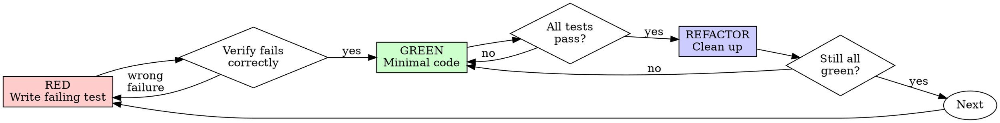

# Test-Driven Development (TDD)

## Overview

Write the test first. Watch it fail. Write minimal code to pass.

**Core principle:** If you didn't watch the test fail, you don't know if it tests the right thing.

**Announce at start:** "Using ecw:tdd to guide test-first implementation."

## Risk-Aware Enforcement

Read `.claude/ecw/session-state.md` for current risk level. If unavailable, use AskUserQuestion to ask the user.

| Risk Level | TDD Mode | Details |
|-----------|----------|---------|
| **P0** | Mandatory + verification log | Full Red-Green-Refactor with logged test output per cycle |
| **P1** | Mandatory | Full Red-Green-Refactor cycle |
| **P2** | Simplified | Red-Green required; Refactor log optional |
| **P3** | Recommended | Encourage but don't enforce; user decides |
| **Bug** | Mandatory (reproduction test) | Write failing test reproducing bug, then fix (RED→GREEN) |
| **Emergency** | Skip | Speed-first; verify with full test suite post-fix; ecw:impl-verify still required |

**ecw.yml override:** If `tdd.enabled: false`, all levels degrade to Recommended.

### Skip Confirmation Protocol

If skipping TDD for any reason (P3 preference, prototype, generated code):

Use AskUserQuestion: "This task qualifies for TDD. Skip TDD for this implementation?"
- Options: "Apply TDD (Recommended)" / "Skip TDD"
- If Skip chosen, log reason and proceed without TDD.

## The Iron Law

```
NO PRODUCTION CODE WITHOUT A FAILING TEST FIRST
```

Write code before the test? Delete it. Start over.

**No exceptions:**
- Don't keep it as "reference"
- Don't "adapt" it while writing tests
- Don't look at it
- Delete means delete

Implement fresh from tests. Period.

## Red-Green-Refactor



### RED - Write Failing Test

Write one minimal test showing what should happen.

**Requirements:**
- One behavior per test
- Clear name describing the behavior
- Real code (no mocks unless unavoidable)

### Verify RED - Watch It Fail

**MANDATORY. Never skip.**

Run the test. Confirm:
- Test fails (not errors)
- Failure message is expected
- Fails because feature missing (not typos)

**Test passes?** You're testing existing behavior. Fix test.
**Test errors?** Fix error, re-run until it fails correctly.

### GREEN - Minimal Code

Write simplest code to pass the test. Don't add features, refactor other code, or "improve" beyond the test.

### Verify GREEN - Watch It Pass

**MANDATORY.**

Confirm:
- Test passes
- Other tests still pass
- Output pristine (no errors, warnings)

**Test fails?** Fix code, not test.
**Other tests fail?** Fix now.

### REFACTOR - Clean Up

After green only:
- Remove duplication
- Improve names
- Extract helpers

Keep tests green. Don't add behavior.

**P0 verification log:** After each cycle, record:
```
[TDD Cycle N] RED: <test name> → FAIL (<expected failure>)
              GREEN: <minimal change> → PASS
              REFACTOR: <what changed or "none">
```

### Repeat

Next failing test for next behavior.

## Test Framework Awareness

Infer default test command from `ecw.yml project.language`:

| Language | Default Test Command |
|----------|---------------------|
| java | `mvn test -pl <module> -Dtest=<TestClass>` |
| go | `go test ./path/to/package -run TestName` |
| typescript | `npm test -- --testPathPattern=<file>` |
| python | `pytest path/to/test.py::test_name -v` |

If `tdd.base_test_class` is set in ecw.yml, extend from it in new test files.

## Good Tests

| Quality | Good | Bad |
|---------|------|-----|
| **Minimal** | One thing. "and" in name? Split it. | `test('validates email and domain and whitespace')` |
| **Clear** | Name describes behavior | `test('test1')` |
| **Shows intent** | Demonstrates desired API | Obscures what code should do |
| **Real code** | Tests actual behavior | Tests mock behavior |

## Common Rationalizations

| Excuse | Reality |
|--------|---------|
| "Too simple to test" | Simple code breaks. Test takes 30 seconds. |
| "I'll test after" | Tests passing immediately prove nothing. |
| "Already manually tested" | Ad-hoc is not systematic. No record, can't re-run. |
| "Deleting X hours is wasteful" | Sunk cost fallacy. Keeping unverified code is debt. |
| "Need to explore first" | Fine. Throw away exploration, start with TDD. |
| "Test hard = design unclear" | Listen to test. Hard to test = hard to use. |
| "TDD will slow me down" | TDD faster than debugging. |
| "Keep as reference" | You'll adapt it. That's testing after. Delete means delete. |

## Red Flags - STOP and Start Over

- Code before test
- Test after implementation
- Test passes immediately
- Can't explain why test failed
- Rationalizing "just this once"
- "Keep as reference" or "adapt existing code"
- "Already spent X hours, deleting is wasteful"

**All of these mean: Delete code. Start over with TDD.**

## Bug Fix Integration

Bug found? Write failing test reproducing it. Follow TDD cycle. Test proves fix and prevents regression.

Never fix bugs without a test. This integrates with `ecw:systematic-debugging` Phase 4.

## Verification Checklist

Before marking work complete:

- [ ] Every new function/method has a test
- [ ] Watched each test fail before implementing
- [ ] Each test failed for expected reason (feature missing, not typo)
- [ ] Wrote minimal code to pass each test
- [ ] All tests pass
- [ ] Output pristine (no errors, warnings)
- [ ] Tests use real code (mocks only if unavoidable)
- [ ] Edge cases and errors covered
- [ ] `tdd.check_test_files` satisfied (if enabled in ecw.yml)

Can't check all boxes? You skipped TDD. Start over.

## When Stuck

| Problem | Solution |
|---------|----------|
| Don't know how to test | Write wished-for API. Write assertion first. Use AskUserQuestion to ask user. |
| Test too complicated | Design too complicated. Simplify interface. |
| Must mock everything | Code too coupled. Use dependency injection. |
| Test setup huge | Extract helpers. Still complex? Simplify design. |
