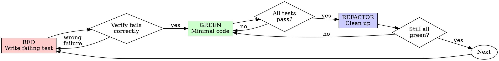

# TDD Execution Protocol: Iron Law + Red-Green-Refactor

## The Iron Law

```
NO PRODUCTION CODE WITHOUT A FAILING TEST FIRST
```

Write code before the test? Delete it. Start over.

**No exceptions:**
- Don't keep it as "reference"
- Don't "adapt" it while writing tests
- Don't look at it
- Delete means delete

Implement fresh from tests. Period.

## Red-Green-Refactor



### RED - Write Failing Test

Write one minimal test showing what should happen.

**Requirements:**
- One behavior per test
- Clear name describing the behavior
- Real code (no mocks unless unavoidable)

### Verify RED - Watch It Fail

**MANDATORY. Never skip.**

Run the test. Confirm:
- Test fails (not errors)
- Failure message is expected
- Fails because feature missing (not typos)

**Test passes?** You're testing existing behavior. Fix test.
**Test errors?** Fix error, re-run until it fails correctly.

### GREEN - Minimal Code

Write simplest code to pass the test. Don't add features, refactor other code, or "improve" beyond the test.

### Verify GREEN - Watch It Pass

**MANDATORY.**

Confirm:
- Test passes
- Other tests still pass
- Output pristine (no errors, warnings)

**Test fails?** Fix code, not test.
**Other tests fail?** Fix now.

### REFACTOR - Clean Up

After green only:
- Remove duplication
- Improve names
- Extract helpers

Keep tests green. Don't add behavior.

**P0 verification log:** After each cycle, record:
```
[TDD Cycle N] RED: <test name> → FAIL (<expected failure>)
              GREEN: <minimal change> → PASS
              REFACTOR: <what changed or "none">
```

**P0 Checkpoint**: After each cycle, also append the verification log to `.claude/ecw/session-data/{workflow-id}/tdd-cycles.md`. This ensures cycle history survives context compaction during long TDD sessions (P0 may have 10+ cycles).

### Repeat

Next failing test for next behavior.
